# eID kaardiga Windows domeeni logimine

**[In English](index.md)**

See dokument pakub põhjalikku tehnilist ülevaadet ja samm-sammulisi juhiseid süsteemiadministraatoritele Eesti ID-kaardi autentimise rakendamiseks Windowsi domeenikeskkonnas.

**Versioon:** 26.03/1

**Väljaandja:** [RIA](https://www.ria.ee/)

**Versiooni info**

| Kuupäev    | Versioon | Muutused/märkused
|:-----------|:--------:|:-----------------------------------------------------------
| 21.01.2019 | 19.01/1  | Avalik versioon, baseerub `18.12` tarkvaral
| 10.03.2022 | 22.03/1  | Uuendatud versioon, baseerub `eID-22.1.0.1922` tarkvaral. — Muutja: Urmas Vanem
| 14.09.2022 | 22.09/1  | Lisatud uute Microsoft poolsete nõuete kirjeldus kasutaja ja eID kaardi sertifikaadi sidumiseks. — Muutja: Urmas Vanem
| 11.12.2023 | 23.12/1  | Eemaldatud `ESTEID-SK 2015` ahel + väiksed muutused. — Muutja: Urmas Vanem
| 31.10.2025 | 25.10/1  | Lisatud Zetes ahelad — Muutja: Raul Kaidro
| 13.03.2026 | 26.03/1  | Konverteeritud Markdown formaati — Muutja: Raul Metsma

---

- TOC
{:toc}

## Taust

Alates Windows Server 2008 SP2 ja Windows Vista SP2 sümbioosist on võimalik kasutada Eesti eID kaarte domeeni sisselogimiseks. See teema on olnud aktuaalne juba 2008. aasta sügisest, mil tehti ka esimesed õnnestunud katsetused. Käesolev dokument kirjeldab platvormid ja konfiguratsioonid, millega on võimalik eID logimise funktsionaalsust lihtsalt ja edukalt rakendada - kasutusel on vaid Microsofti operatsioonisüsteemid ja ID-tarkvara.

eID kaardiga arvutisse sisselogimine on teenus, mis on tänaseks Eesti ettevõtetes juba üsna levinud. eID logini rakendamisel on palju häid omadusi nagu lihtsustatud sisselogimine – kasutajatel pole vaja parooli meeles pidada, turvalisuse kasv tänu kaheastmelisele autentimisele jpm. Ka tehniline konfiguratsioon selle lubamiseks ei ole ülemäära keeruline.

eID login on täna toetatud ja testitud järgmistel platvormidel:

*   **Serverid:** Kõik ametlikult toetatud Windows serverite versioonid, k.a. Windows Server 2025.
*   **Kliendid:** Kõik ametlikult toetatud Windows operatsioonisüsteemide versioonid, k.a. Windows 11.

## Rakendamine

eID logini rakendamine eeldab kogumit süsteemseid ettevalmistusi nii domeeni kui klientide häälestusel. Lisaks tuleb kasutajakontod domeenis siduda eID autentimissertifikaatidega.

eID kaartidega domeeni logimiseks tuleb keskkond konfigureerida järgnevalt:

*   Domeeni kontrollerid peavad omama endi tuvastamiseks spetsiifiliste omadustega sertifikaati, mida usaldavad ka kliendid.
*   Domeeni kontrollerid peavad usaldama [SK ID Solutions](https://www.skidsolutions.eu/resources/certificates/) (`EE-GovCA2018`) ja [Zetes](https://repository.eidpki.ee/) (`EEGovCA2025`) eID kaartide harude juur- ja kesktasemete sertifikaate.
*   Klientarvutitel peab olema installeeritud ID-tarkvara (täna, märtsis 2026, soovitame kõige värskeimat versiooni 25.10.23.8403).
*   Klientarvutid peavad toetama sertifikaate, millel puudub spetsiaalne kiipkaardiga logimise toe atribuut (`Smart Card Logon` EKU) ja samuti peab lubatud olema ECC sertifikaatide kasutamine arvutisse logimise eesmärgil.
*   Domeenis peab eID kaartide autentimissertifikaat olema seotud kindla kasutajaga.

Täpsemalt käsitleme konfiguratsiooni ettevalmistust järgmistes alampunktides.

## Domeenist

Domeeni ettevalmistuse osadeks on poliitikate häälestus domeeni kontrolleritele ja töökohtadele. Samuti peab domeeni kontrolleril olema kindlatele omadustele vastav (server authentication, smart card logon) sertifikaat enda tuvastamiseks ja kiipkaardiga logimise võimaldamiseks.

### Domeeni kontrolleri sertifikaat

Nagu juba öeldud, domeeni kontrollerid vajavad eID logini toimimiseks sertifikaate, millega nad suudavad klientarvutitele endi identiteeti ja kiipkaardiga logimise võimekuse tuge tõestada. Kõige mõistlikum on need sertifikaadid küsida lokaalse PKI lahenduse käest. Vaikimisi Windows CA konfiguratsioonis on võimalik publitseerida `Domain Controller Authentication` mall, mida reeglina küsivad endale kõik domeeni kontrollerid. Juhul kui domeeni kontrolleritel sertifikaatide autoenrollment ei ole lubatud, tuleb nimetatud sertifikaadid küsida "käsitsi".

Piltlikult väljendub nõutav domeeni kontrollerite sertifikaatide konfiguratsioon järgmisel joonisel:

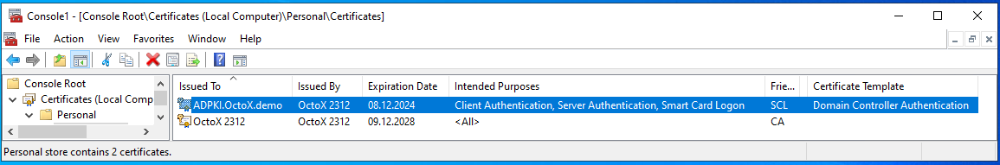

Juhul, kui ettevõttel PKI lahendus puudub, tundub mõistliku otsusena selle loomine. Alternatiivina võib mõelda domeeni kontrolleri sertifikaadi hankimisele kolmandatest allikatest.

### Poliitikad

#### Sertifikaatide publitseerimine

eID kaartide ja nendega seotud sertifikaatide kasutamisel domeeni sisselogimisel peavad domeeni kontrollerid neid usaldama, nii kesk- kui juurtaseme sertifikaadid peavad paiknema õigetes konteinerites. Sertifikaatide kehtivuse kontrollimiseks peab olema ligipääs SK ja Zetes OCSP teenusele.

eID kaardiga domeeni logimise võimaldamiseks tuleb kesktaseme sertifikaadid (`ESTEID2018`, `ESTEID2025`) paigaldada ka domeeni NTAuthCertificates konteinerisse. Seda saame teha käsuga `certutil -dspublish -f 'SERDINIMI' NTAuthCA`. Samuti võime domeeni konteinerisse lisada ka juurtaseme sertifikaadi, siis on käsuks `certutil -dspublish -f 'SERDINIMI' RootCA`.

Sertifikaadid on allalaetavad lehelt <https://www.skidsolutions.eu/resources/certificates/> ja <https://repository.eidpki.ee/crt/>. Tänase seisuga vajame järgmiseid sertifikaate:

*   [EE-GovCA2018](https://c.sk.ee/EE-GovCA2018.der.crt) - usaldusväärne juursertifikaat;
*   [EEGovCA2025](https://crt.eidpki.ee/EEGovCA2025.crt) - usaldusväärne juursertifikaat;
*   [ESTEID2018](https://c.sk.ee/esteid2018.der.crt) - usaldusväärne kesktaseme sertifikaat;
*   [ESTEID2025](https://crt.eidpki.ee/ESTEID2025.crt) - usaldusväärne kesktaseme sertifikaat.

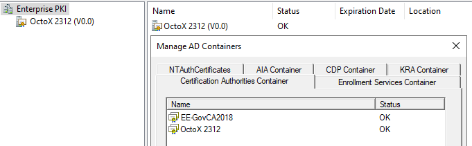

Lisaks võime SK/Zetes juur- ja kesktaseme sertifikaadid publitseerida kas ainult domeeni kontrolleritele või ka kõikidele domeeni serveritele ja/või tööjaamadele või nende gruppidele kesksete poliitikate abil.[^1]

Kui soovime publitseerida sertifikaate domeeni kontrolleritel automaatselt, siis soovitame modifitseerida Default Domain Controllers või mõnda teist domeeni kontrollerite OU tasemelt rakenduvat poliitikat. Sertifikaadid tuleb paigutada konteineritesse vastavalt tüübile, juursertifikaadid juur- ja kesktaseme sertifikaadid kesktaseme konteineritesse.  Sertifikaadid võib keskse poliitika abil automaatselt paigutada ka kõikidele domeeni serveritele ja/või tööjaamadele.

Järgnevalt näitame, kuidas publitseerida juur- ning kesktaseme sertifikaate. Sertifikaatide publitseerimiseks domeeni kontrollerite usaldatud ja kesktaseme sertifikaatide kaustades:

1.  Ava **Group Policy Management** konsool ja vali omaduste lisamiseks sobilik GPO, kliki **Edit...**:

    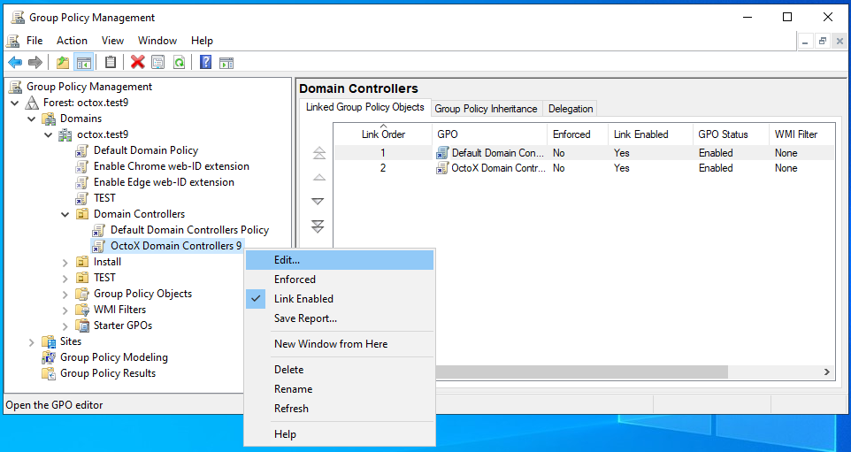

2.  Vali kaust `Computer Configuration/Policies/Windows Settings/Security Setting/Public Key Policies`.

    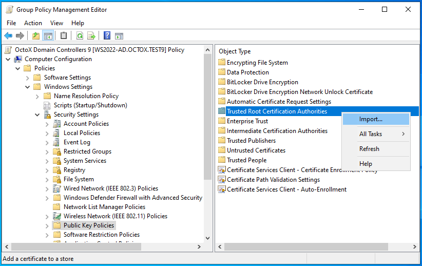

3.  EE-GovCA2018 ja EEGovCA2025 sertifikaadi lisamiseks:
    a. Paremkliki kaustal `Trusted Root Certification Authorities` ja vali `Import`.
    b. Kliki **Next**, vali `EE-GovCA2018` või `EE-GovCA2025` sertifikaat ja impordi see.

    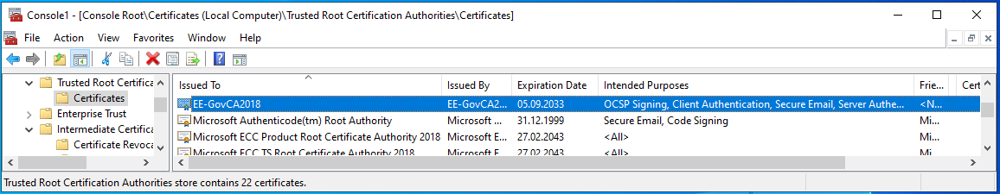

4.  Kesktaseme sertifikaadi lisamiseks:
    a. Paremkliki kaustal `Intermediate Certification Authorities` ja kliki `Import`.
    b. Kliki **Next**, vali sertifikaat `ESTEID2018` või `ESTEID2025` ja impordi see.

    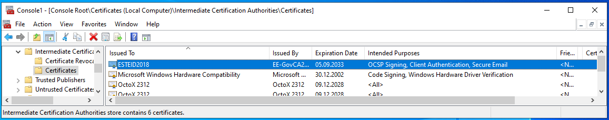

Nagu eelnevatelt illustreerivatelt piltideltki näha on, muutuvad sertifikaadid nähtavateks vastavalt Trusted Root Certification Authorities  ja Intermediate Certificate Authorities konteinerites. Kuna tegemist on kesksete poliitikatega siis rakenduvad kirjeldatud omadused järgmise poliitikate uuendustsükli ajal kõikidele domeeni kontrolleritele. Poliitikate rakendumise kiirendamiseks võib kasutada käsku `gpupdate /force`. Ja nagu juba mainitud, siis samal viisil võib vajalikud sertifikaadid publitseerida ka kõikidele teistele Windows tööjaamadele ja serveritele, kui see vajalik peaks olema. 

### eID kaardi omaduste häälestus domeenis

Toetamaks eID kaardiga domeeni logimist keskselt kõikidel klientarvutitel kasutame siin näites domeeni taseme poliitikat:[^2]

1.  Ava **Group Policy Management** konsool ja vali omaduste lisamiseks sobilik GPO, kliki **Edit...**:

    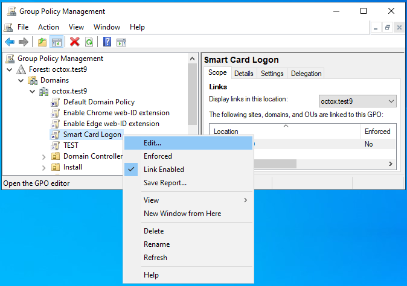

2.  Vali kaust `Computer Configuration/Policies/Administrative Templates/Windows Components/Smart Card` ja muuda järgmiseid omadusi:
    *   `Allow certificates with no extended key usage certificate attribute` = **Enabled** - lubamaks sertifikaate, milliste EKU-s on kirjeldamata `Smart Card Logon`;
    *   `Allow ECC certificates to be used for logon and authentication` = **Enabled** – lubamaks domeeni logimine kaartidega milliste krüptograafia baseerub elliptilistel kõveratel.

Peale muudatuste sisseviimist näeb loodud poliitika välja järgmine:

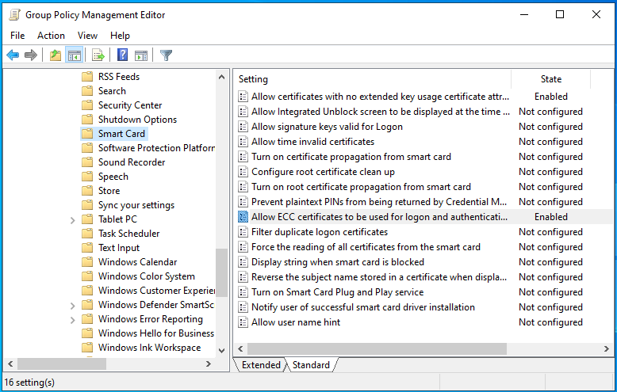

### eID kaartide toetamine domeeni logimiseks üksikarvutitel

Juhul, kui eID kaartidega tahetakse logida näiteks domeenivälisest koduarvutist domeeni serverisse üle RDP ühenduse, tuleb koduarvuti häälestada toetama eID kaarte (logimise vaates). Selleks tuleb koduarvutil administraatori õigustes käivitada lokaalne poliitikate haldur käsuga `gpedit.msc`. Poliitikate halduris tuleb arvuti konfiguratsiooni viia sisse täpselt sama muudatus mis kirjeldatud ülemises peatükis (eID kaardi omaduste häälestus), tuleb lubada `Allow certificates with no extended key usage certificate attribute` ja ka `Allow ECC certificates to be used for logon and authentication`! Peale kirjeldatud muudatuse sisseviimist tuleb kas oodata poliitika rakendumist, uuendada poliitikaid käsuga `gpupdate /force` või restartida arvuti, ja eID kaartidega logimine osutubki võimalikuks (kui domeen ja server seda toetab muidugi).

### OCSP sertifikaadikontrolli meetodi keskne nõue

Hetkel kasutusel olevate eID kaartide puhul ei ole meil vajalik OCSP teed enam keskselt kirjeldada, kuna see on sertifikaadis juba sees. CRL tee neis sertifikaatides puudub, seega toimub sertifikaadi kehtivuse kontroll vaikimisi ainult vastu vaba ligipääsuga AIA OCSP teenust (<http://aia.sk.ee/esteid2018>, <http://ocsp.eidpki.ee>).

> **Märkus:** OCSP nõude kehtestamise korral vii end kurssi ka mõistega OCSP maagiline number.[^3]

## Kasutajate sidumine sertifikaatidega

Seoses Microsoft tarkvara uuendustega, mis on kirjeldatud artiklis [KB5014754](https://support.microsoft.com/en-gb/topic/kb5014754-certificate-based-authentication-changes-on-windows-domain-controllers-ad2c23b0-15d8-4340-a468-4d4f3b188f16), ei ole enam soovituslik kasutada AD GUI’d kasutaja ja sertifikaadi sidumiseks. Põhjuseks on see, et GUI abil seotakse kasutaja sertifikaadis olevate väljadega `issuer` ja `subject`. Nüüdsest aga peetakse seda meetodit ebaturvaliseks ja soovitatakse kasutaja siduda sertifikaadi väljadega `issuer` ja `serialnumber`.

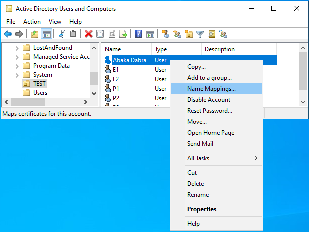

Kasutaja sertifikaadi hankimiseks on järgmised võimalused:

1.  Küsida kasutaja sertifikaat [LDAP kataloogiteenusest](https://www.skidsolutions.eu/resources/ldap/) isikukoodi alusel. Soovi korral saab seda teha ka DigiDoc4 kliendi abil.
2.  Juhul kui eID kaart on eelnevalt arvutis registreeritud saab sertifikaadi ka kasutajate sertifikaatide hoidlast MMC abil (`Certificates` snap-in, `Personal/Certificates`).
3.  Käsuga `certutil.exe –scinfo` kui eID kaart on lugejas.
4.  ...

Juhin tähelepanu ka asjaolule, et eID kaartidel on kaks sertifikaati. Domeeni logimiseks eID kaardiga peame kasutama sertifikaati, millisel on EKU all kirjeldatud `Client Authentication`.

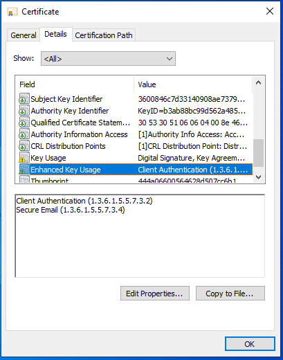

### Kasutaja sertifikaadiga sidumise kirjeldus

Nagu juba öeldud, siis kasutades AD GUI-d seotakse sertifikaat kasutajaga väljade `issuer` ja `subject` abil ja see kombinatsiooni ei ole Microsoft'i poolt enam soovituslik. Lisaks on Eesti eID kaartide puhul `issuer` väli vähemalt ID-kaardi ja Digi-ID kaardi puhul identne. 

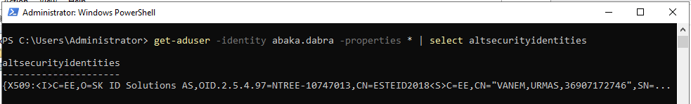

Seega on ilmselt mõistlik järgida Microsofti soovitust ja siduda sertifikaat kasutajaga väljade `issuer` ja `serialnumber` abil. Seda saame üle GUI teha kasutades näiteks ADSI Edit võimalusi.

**Tuleb märkida, et nii `issuer`'i kui `serialnumber` stringid tuleb sidumisel ümber keerata!** See tähendab, et kui:

1.  **Issuer** on kirjeldatud sertifikaadis kui:
    `CN = ESTEID2018 / 2.5.4.97 = NTREE-10747013 / O = SK ID Solutions AS / C = EE`
    ...AD-s peab see olema:
    `<I>C=EE,O=SK ID Solutions AS,OID.2.5.4.97=NTREE-10747013,CN=ESTEID2018`

2.  **Serial number** on kirjeldatud sertifikaadis kui `8958ee38a565845e9107720de61ca64d`, siis AD-s peab see olema `4da61ce60d7207915e8465a538ee5889`. Palun siin pöörata tähelepanu ka asjaolule, et ümberpööramine käib kahe sümboli kaupa!

Korrektne kasutaja ja sertifikaadi sidumise string ADSI Edit utiliidis näeb välja järgmine:[^4]
`X509:<I>C=EE,O=SK ID Solutions AS,OID.2.5.4.97=NTREE-10747013,CN=ESTEID2018<SR>4da61ce60d7207915e8465a538ee5889`


Suuremate keskkondade ja kasutajate arvu puhul tuleb kindlasti mõelda eelkirjeldatud tegevuste automatiseerimisele!

## Klientarvutite ettevalmistus

### Tarkvara

Klientarvutitele tuleb installeerida ID-tarkvara (täna, novembris 2025, soovitame kõige värskeimat versiooni 25.10.23.8403). Tegelikult piisab ka eID kaardi minidraiveri korrektsest toimimisest, ent standardina ikkagi installeeritakse kogu ID-tarkvara.

### Omadused

Vajalikud omadused rakenduvad klientarvutitele domeeni tasemelt eelkirjeldatud etteantavate kesksete poliitikatega.

## Lõplik rakendamine

eID logini reaalseks rakendamiseks tuleb lihtsalt teha nagu eelnevalt kirjeldatud. Loomulikeks eeldusteks on:

1.  lahenduse testimine test ja/või arenduskeskkonnas;
2.  lahenduse rakendamine töökeskkonnas;
3.  administraatorite koolitus;
4.  kasutajate koolitus.

Peale konfiguratsiooni jõustumist klientarvutis saame logimise aknas valida logimise viisiks kiipkaardi .

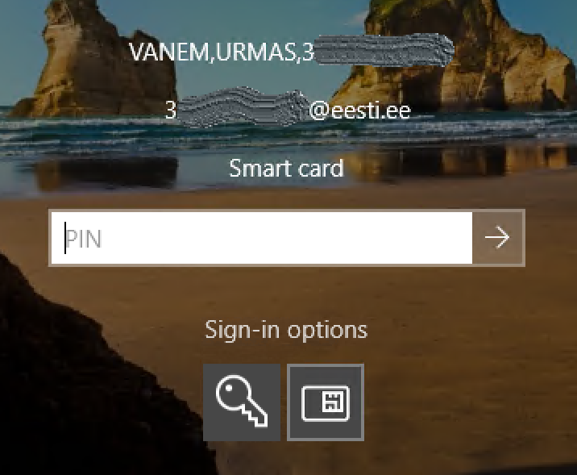

### eID kaardiga domeeni logimise nõue

Mõnikord võime soovida, et kasutajad saaksidki ainult eID kaardiga süsteemidesse sisse logida (teisisõnu keelame parooli kasutamise). See võib puudutada nii tavalisi või spetsiifilisi tööjaamu ja/või RDP servereid. Nõude kehtestamiseks tuleb soovitud arvutitele rakendada järgmine poliitika:
`Computer Configuration / Policies / Windows Settings / Security Settings / Local Policies / Security Options` `Interactive logon: Require Windows Hello for Business or Smart Card` = **Enabled**.

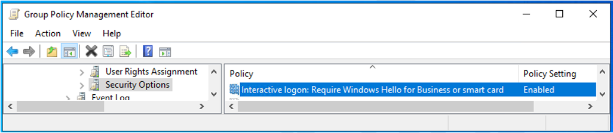


### Arvuti käitumise juhtimine kiipkaardi eemaldamisel

Võime konfigureerida ka arvuti või arvutite grupi käitumise kiipkaardi eemaldamisel. (Muidugi töötab see poliitika vaid juhul, kui oleme arvutisse/domeeni kiipkaardiga loginud.) Valikutes on:

1.  No Action (vaikimisi);
2.  Lock Workstation;
3.  Force Logoff;
4.  Disconnect if a remote RDP session is active.

Muudatuse rakendamiseks tuleb määrata üks ülaltoodud väärtustest poliitikale `Computer Configuration / Policies / Windows Settings / Security Settings / Local Policies / Security Options` `Interactive logon: Smart card removal behavior`.

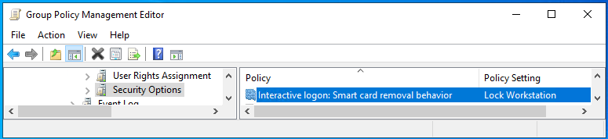

## Võimalikud probleemid

### Proxy

Kui domeenis on välistele HTTP aadressidele ligipääsuks häälestatud proxy ja see poliitika kehtib ka domeeni kontrollerite süsteemikontole, ei õnnestu sertifikaadi kehtivuse kontroll ja seoses sellega ka login.

**Mis teha:** tuleb domeeni kontrolleritele vastav proxy häälestus luua. Vt. näiteks `netsh.exe` võimalusi.

### Sertifikaat mitmel kasutajal

Kui üks autentimissertifikaat on seotud rohkem kui ühe kasutajaga domeenis, siis logimine ei õnnestu.

**Mis teha:** eemaldada sertifikaat sidumine "vale(de)lt" kasutaja(te)lt.

## Kokkuvõte

eID kaartidel baseeruv domeeni logimine on hea võimalus lihtsustada kasutajate domeeni sisselogimist tõstes samaaegselt süsteemide turvalisust.  

Kasutajate vaates on kindlasti mugavaks omaduseks parooli unustamise vältimine – meeles tuleb pidada vaid autoriseerimise PIN-koodi (mis eID kaartide kasutajatel on tõenäoliselt nagunii teada).

Administraatorite ja kasutajatoe vaade on arvatavasti samuti positiivne, kuna lisaks turvalisuse kasvule esineb vähem probleeme paroolide unustamisega kasutajate poolt. Samuti on vastava konfiguratsiooni loomine küllaltki lihtne.

---
[^1]: Kui oleme eelnevalt kirjeldatud meetodil nii kesk- kui juurtaseme sertifikaadid juba domeenis publitseerinud, puudub selleks küll otsene vajadus. Saame samas näiteks kesktaseme sertifikaadi publitseerida domeeni NTAuthCertificates konteinerisse paigutamisega ja juurtaseme sertifikaadi tavalise domeeni poliitikaga, nagu kirjeldatud allpool. Sellega on lugu tegelikult üldse natuke segane, sest kuigi teoreetiliselt Microsoft nõuab, et kaardi sertifikaadi väljastanud CA sertifikaat kuuluks domeeni NTAuthCertificates konteinerisse (vt. [Guidelines for enabling smart card logon with third-party certification authorities](https://docs.microsoft.com/en-us/troubleshoot/windows-server/windows-security/enabling-smart-card-logon-third-party-certification-authorities)), siis praktikas töötab eID kaardiga login ka siis, kui seda pole tehtud ja ahel on lihtsalt usaldatud. Siiski soovitame konfiguratsiooni luues järgida Microsofti tehnilisi nõudeid.
[^2]: Muidugi võime vastava poliitika rakendada ka ainult klientarvutite ja/või serverite OU baasilt või mõnel muul loogikal baseeruvalt.
[^3]: [How Certificate Revocation Works](https://docs.microsoft.com/en-us/previous-versions/windows/it-pro/windows-server-2008-R2-and-2008/ee619754(v=ws.10))
[^4]: Kui issuer on meil reeglina konstant, siis serialnumber tuleb ümber pöörata kõikidel kasutajatel. Kasutage selle PowerShelli funktsiooni:

    ```powershell
    function Reverse-SerialNumber { param([string]$SerialNumber)
      $pairs = [regex]::Matches($SerialNumber, '..').Value;
      [array]::Reverse($pairs);
      return -join $pairs
    }
    Reverse-SerialNumber -SerialNumber "8958ee38a565845e9107720de61ca64d"
    # Väljund: 4da61ce60d7207915e8465a538ee5889
    ```