# Configuring IIS to support Estonian Digital ID-card for authentication

**[Eesti keeles (In Estonian)](index.et.md)**

**Version:** 26.04/1

**Published by:** [RIA](https://www.ria.ee/)

**Version information**

| Date       | Version  | Changes/Notes
|:-----------|:--------:|:-----------------------------------------------------------
| 21.01.2019 | 19.01/1  | Public version, based on `18.12` software.
| 12.02.2019 | 19.02/1  | Added OCSP options. — Changed by: Urmas Vanem
| 01.10.2019 | 19.10/1  | Added information about Windows server (IIS) patches statuses and future availability by versions. — Changed by: Urmas Vanem
| 18.10.2019 | 19.10/2  | Added information about Windows Server 2016 update `KB4516061`, which solves Chrome-IIS problem. — Changed by: Urmas Vanem
| 08.11.2019 | 19.11/1  | Added information about Windows Server 2019 update `KB4520062`, which solves Chrome-IIS problem. — Changed by: Urmas Vanem
| 14.11.2019 | 19.11/2  | Added information about Windows Server 1903 (SAC) update `KB4524570`, which solves Chrome-IIS problem. — Changed by: Urmas Vanem
| 12.12.2019 | 19.12/1  | Added recommendations for securing IIS. — Changed by: Urmas Vanem
| 14.12.2020 | 20.12/1  | Added security recommendations to block access for certificates issued by third sub-CA's. — Changed by: Urmas Vanem
| 17.12.2020 | 20.12/2  | Added some security recommendations to chapter "Denying access for unnecessary CA-s". — Changed by: Urmas Vanem
| 03.03.2021 | 21.03/1  | Removed deprecated info of IIS and Chrome combination and updated to the latest. — Changed by: Kristjan Vaikla
| 30.04.2021 | 21.04/1  | Support for aged `ESTEID-SK 2011` certificates removed. — Changed by: Urmas Vanem
| 14.12.2021 | 21.12/1  | Server platform upgraded to version 2022. Added ECDSA certificate request procedure. TLS and cipher recommendations are updated. — Changed by: Urmas Vanem
| 18.01.2022 | 22.01/1  | Added Windows Server 2022 and `TLS 1.3` protocol related information, including procedure for enabling in-handshake authentication method to allow certificate-based authentication with `TLS 1.3` protocol. — Changed by: Urmas Vanem
| 18.12.2023 | 23.12/1  | Removed `ESTEID-SK 2015` chain. — Changed by: Urmas Vanem
| 31.10.2025 | 25.10/1  | Added Zetes certificates. — Changed by: Raul Kaidro
| 22.04.2026 | 26.04/1  | Converted to Markdown format. — Changed by: Raul Metsma

Instructions on how to configure IIS to support Estonian eID cards for authentication.

---

- TOC
{:toc}

## Introduction

In this guide we describe how to configure Microsoft IIS web services to require two-way SSL. On the server side we can use any certificate with `server authentication` EKU, trusted by clients. On client side we use any of Estonian eID card (ID-card, residence card, digital ID or e-Resident's digital ID).

Windows Server 2022 and Windows 10 operating systems have been used to create this guide. On client side we support certificates issued from the [SK ID Solutions](https://www.skidsolutions.eu/resources/certificates/) `EE-GovCA2018` and [Zetes](https://repository.eidpki.ee/) `EEGovCA2025` chain. To recognize user smart card certificate, we also need ID-software on the client side[^1]. Server certificate in this demo-guidance is issued from OctoX test CA.

We can use different authentication methods in IIS. In this guide we configure IIS in simplest possible way and use only anonymous authentication after authentication users can access website as dedicated (IUSR) user.

Currently we tested the configuration with the following browsers (latest versions):

1.  Microsoft Edge
2.  Mozilla Firefox
3.  Google Chrome

## Configuration for one-way SSL/TLS

### Configuring Windows Server certificate

IIS server needs a TLS certificate to offer web services securely. In our example we use certificate issued from OctoX test environment. Both clients and web server itself must trust the certificate.

In domain environment it can make sense to use internal CA as web server certificate issuer. But if the security level is not good enough or we want to offer IIS services widely (for public services for example), it can be a good idea to get a certificate from any commonly trusted CA.

#### Requesting server certificate

Because using IIS management console for querying TLS certificate is quite limited, we use certificates management console for that. Let's start `mmc.exe` on IIS server and add `Local Computer/Certificates` snap-in into it. Now we have to create `custom query`:

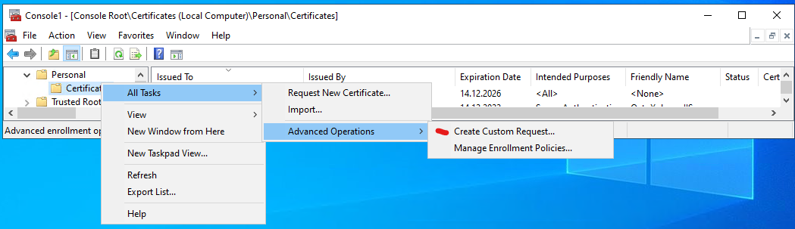

Let's click three times *Next* and then select *Details, Properties*. Certificate query custom request properties window appears:

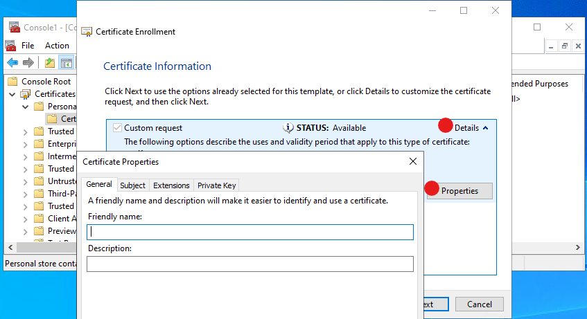

In the certificate query properties window we can set the exact properties we want to see in our new certificate.

If we need to do similar queries more often, then we recommend to use `PowerShell` for automation.

##### Tab General

Here we can set certificate friendly name and description. These fields are actually not inner parts of certificate but can be useful for later certificate selection and understanding what is what.

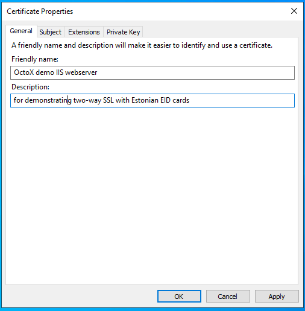

##### Tab Subject

Here we describe certificate subject as usual. If we want to use different DNS aliases or common name for any reason is not FQDN, then it is necessary to describe SAN DNS names in this tab too!

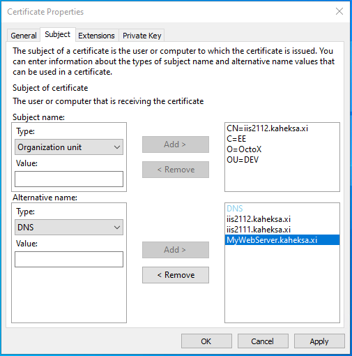

##### Tab Extensions

In extensions tab we set following options:

1.  Key Usage:
    1.  Digital signature;
    2.  Key encipherment.
2.  Extended Key Usage:
    1.  Server Authentication.

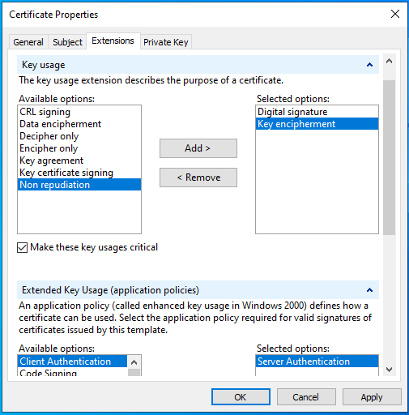

##### Tab Private Key

Here we select CSP (cryptographic service provider). In our example we want to use `ECDSA_P256`, so we unselect RSA and select `ECDSA_P256`.

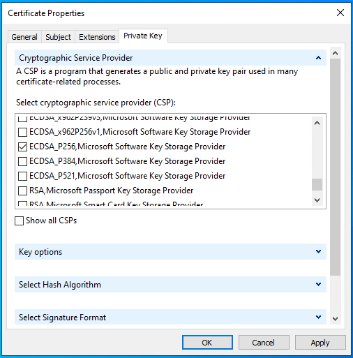

Let's click *OK* and *Next* to save the request file with any name you like in `Base64` format.

We can check the contents of request file with command `certutil -dump REQUEST_FILE_NAME`.

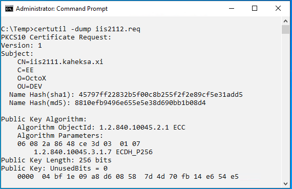

We can also see DNS aliases we defined in this query:

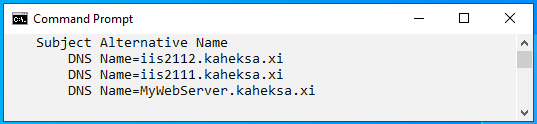

Now we must send the query file to any CA for certificate generation. If everything goes fine, we'll get the certificate back.

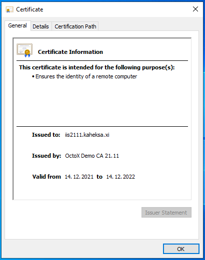

#### Installing certificate

Issuing CA certificate `OctoX Demo CA 21.11` must be trusted by our IIS server. It means it must be in IIS server `Trusted Root Certification Authorities` container.[^2]

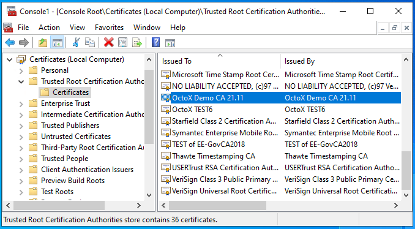

Certificate for IIS server must belong to `Local Computer/Personal` certificates container on IIS server.

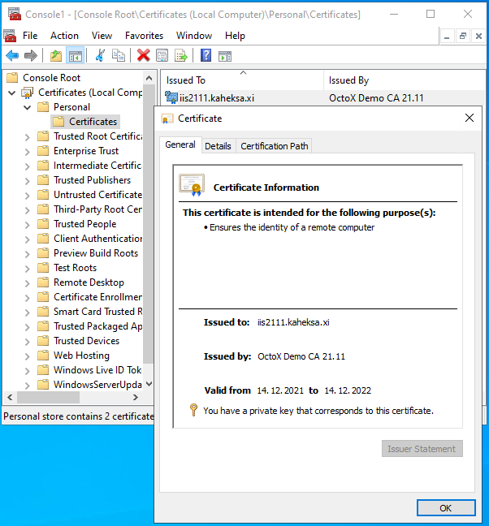

### Configuring IIS for one-way SSL

To configure one-way SSL on IIS server we must add new HTTP(S) binding (usually port 443) and apply certificate to it. And it is definitely a good idea to disable legacy TLS protocols!

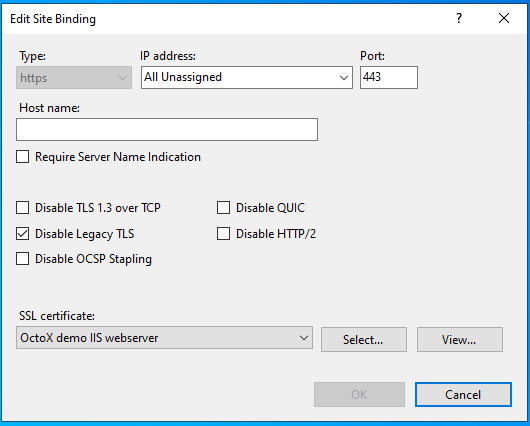

After applying settings one-way SSL works and we can access website over HTTPS protocol.

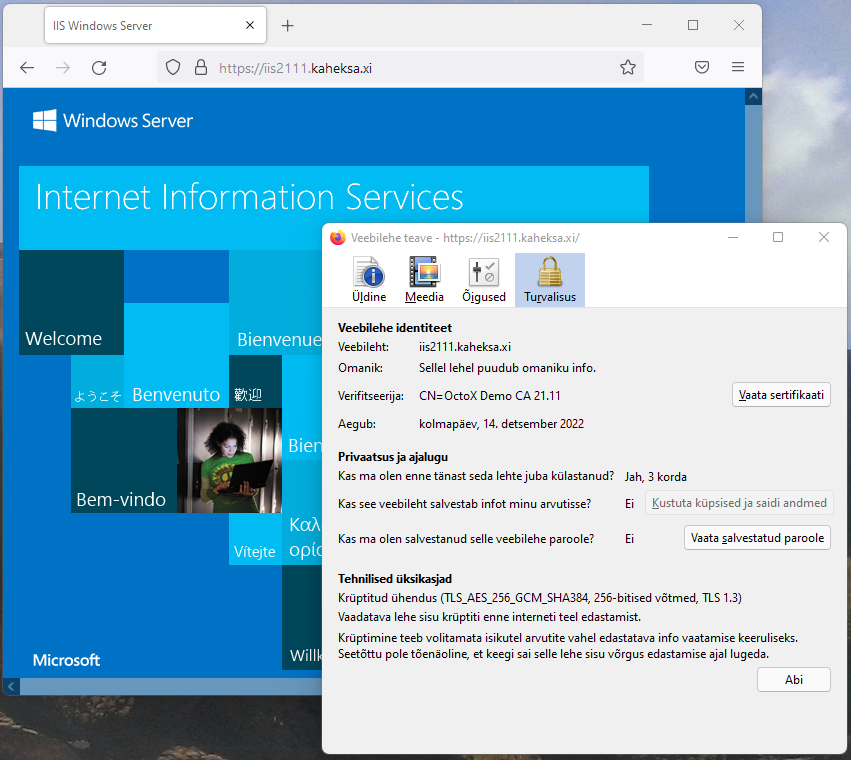

In information window of Firefox, we can see that:

1.  Our web server certificate `iis2111.kaheksa.xi` is in use;
2.  TLS protocol version 1.3 is in use.

#### Disabling HTTP access

To disable access to website over unsecure HTTP (usually port 80) we can remove the binding from configuration and disable firewall access to port 80. As an alternative we can create automatic redirection rule from port 80 to port 443. It can be useful for cases when users do not type https:// prefix to server address and cannot reach to website.

## Requiring two-way SSL, certificate authentication

### Preset

> **Note:** As of 2022 and still applicable in 2026, IIS 10/Schannel running on Windows Server 2022 uses post-handshake authentication method with `TLS 1.3` by default. But because common browsers do not support this method, this configuration in practice is faulty. The problem with `TLS 1.3` is that the server will not send certificate request query to the client in default configuration and because of missing client certificate server resets connection. To re-enable certificate-based authentication we must turn `TLS 1.3` off. Alternative way is to enable in-handshake authentication method, we discuss it later in chapter "[Enabling in-handshake authentication method](#enabling-in-handshake-authentication-method)".

> **Note:** On Windows Server 2025 this has been resolved natively — IIS adds a "Negotiate Client Certificate" checkbox directly in the HTTPS binding UI, enabling in-handshake authentication without the `netsh` workaround described below.

Until the problem exists with Windows Server 2022, we must turn `TLS 1.3` over TCP off. We can do it by selecting `Disable TLS 1.3 over TCP` in IIS bindings window:

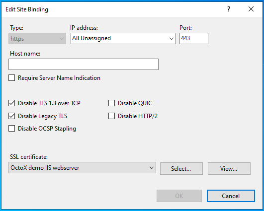

### Configuring IIS server to support Estonian eID cards

To enable two-way SSL certificate authentication must be turned on. By default, all trusted certificates with `client authentication` extension in EKU can be used. Client certificate chain must be known by server, intermediate certificates must belong to intermediate certificates container and root certificates must belong to `Trusted Root Certification Authorities` container.

In our case we need to add following certificates into IIS server certificate store:

1.  Trusted Root Certification Authorities:
    1.  `EE-GovCA2018` (<http://c.sk.ee/EE-GovCA2018.der.crt>)
    2.  `EEGovCA2025` (<https://crt.eidpki.ee/EEGovCA2025.crt>)
2.  Intermediate Certification Authorities[^3]:
    1.  `ESTEID2018` (<http://c.sk.ee/esteid2018.der.crt>)
    2.  `ESTEID2025` (<https://crt.eidpki.ee/ESTEID2025.crt>)

After defining certificate chains, we can enable certificate requirement in website SSL settings:

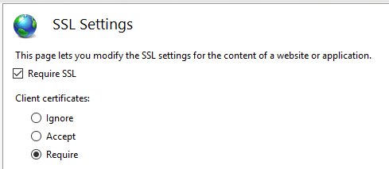

Described configuration allows access to website over port 443, client certificate is required. While connecting to server over https certificate request appears:

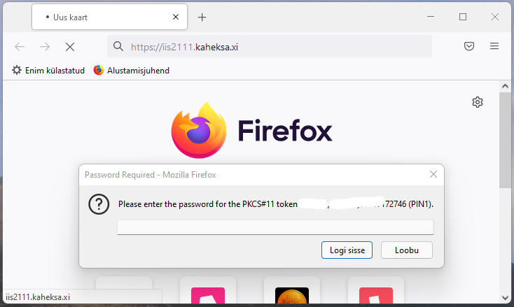

After entering PIN, certificate revocation status will be checked by IIS server and if it is good, user can access website.

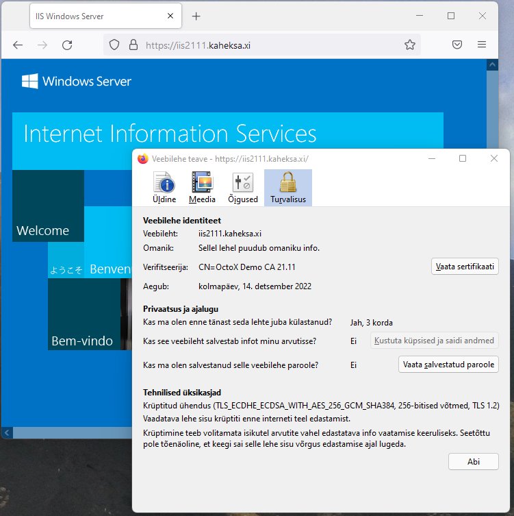

As an alternative we can use certificate acceptance instead of requiring it. In this case we can access websites also with username or password or without authentication at all.

### Enabling in-handshake authentication method

If we want to use `TLS 1.3` protocol with Windows Server 2022 IIS 10, we must enable the in-handshake authentication method. With this method certificate request query is sent to client with *Server Hello*.

Please follow next steps to enable in-handshake authentication method:

1.  Document `Certificate Hash` and `Application ID` values with command `netsh http show sslcert`:

    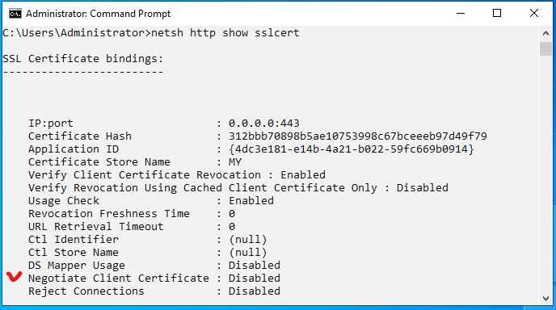

2.  Remove certificate binding from port 443 with command `netsh http del sslcert 0.0.0.0:443`:

    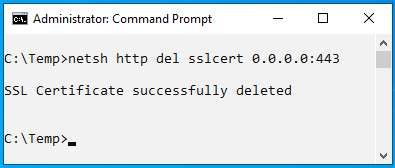

3.  Bind certificate to port 443 again and also enable in-handshake authentication with command `netsh http add sslcert ipport=0.0.0.0:443 certhash=312bbb70898b5ae10753998c67bceeeb97d49f79 appid={4dc3e181-e14b-4a21-b022-59fc669b0914} certstorename=MY clientcertnegotiation=Enable`:

    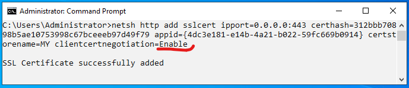

If we check certificate binding information again, we can see that `Negotiate Client Certificate` is now enabled:

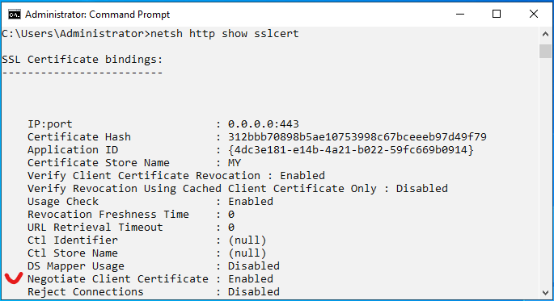

> **Note:** Because session renegotiation is disabled with `TLS 1.3`, we must understand that authentication must happen on first page. If we already have one-way SSL connection with any website, renegotiation will fail if some parts of this site/page require it. So, if necessary, we must somehow solve this "landing" problem.

### Authentication

In our configuration we use only anonymous authentication:

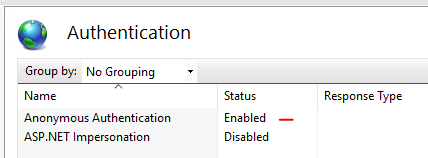

## Possible additional configurations

The purpose of this document is not to give exact guidance how to configure or secure web sites. But we want to introduce useful configurations for using two-way SSL with Estonian eID cards. In the following chapters, we point out possibilities we think are important.

### Filtering certificate list on client side

By default, all personal certificates with private key and `user authentication` EKU on client side are accepted by IIS. But it is possible to teach IIS to share list of acceptable certificate authorities with clients – in this case browser shows only certificates from supported chains to user.

Our goal is to support only certificates issued from chains under root CA `EE-GovCA2018` and `EEGovCA2025`.

1.  Get IIS certificate information with command `netsh http show sslcert 0.0.0.0:443`:

    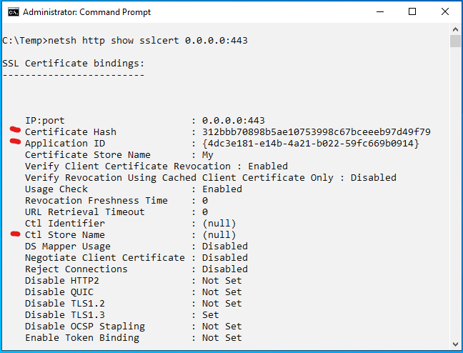

2.  Remove certificate binding with command `netsh http del sslcert 0.0.0.0:443`:

    

3.  Add certificate again and point it to user store `Client Authentication Issuers` as list for acceptable certification authorities for clients. Command is `netsh http add sslcert ipport=0.0.0.0:443 certhash=1e75c77c696aa4d49686bb1ef73ac3b07fdff38a appid={4dc3e181-e14b-4a21-b022-59fc669b0914} sslctlstorename=ClientAuthIssuer`:

    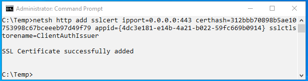

    `Certhash` and `appid` values can be taken from the output in step 1 above.

4.  Check that `ClientAuthIssuer` value exists after `CTL Store Name`:

    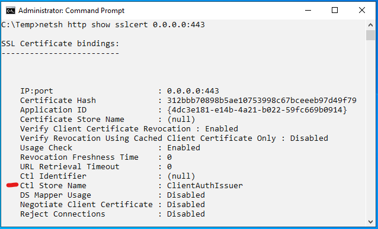

    We can also check IIS configuration to be sure SSL certificate is correctly bound to port 443.

5.  Enable certificate filtering option in IIS server registry by adding value `HKEY_LOCAL_MACHINE\SYSTEM\CurrentControlSet\Control\SecurityProviders\SCHANNEL\SendTrustedIssuerList=1`:

    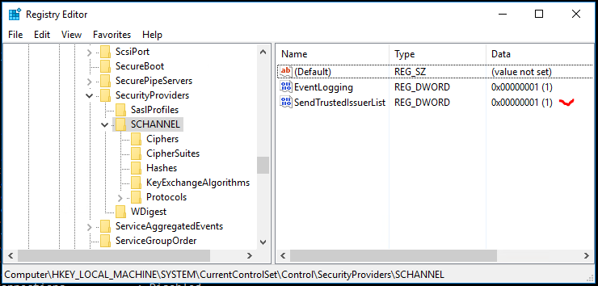

6.  Add our intermediate CA to certificates container `Client Authentication Issuers` in IIS server to support only specific CA:

    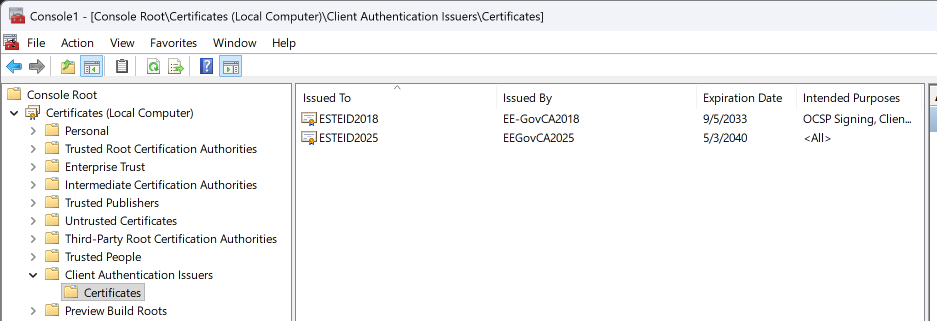

7.  If necessary, restart the IIS service or server and check if everything works as expected.

### Checking revocation status of client certificates against OCSP service

Using OCSP service we can check revocation status of client certificates practically in real time. In every client authentication attempt web server sends query to OCSP service, which responds with client certificate revocation status.

Certificates issued by `ESTEID2018` and `ESTEID2025` CA have AIA OCSP service location included in end user certificate (<http://aia.sk.ee/esteid2018> and <http://ocsp.eidpki.ee>), so we do not need to make any change here. But we still can configure our server to check revocation status of certificates using AIA OCSP service:

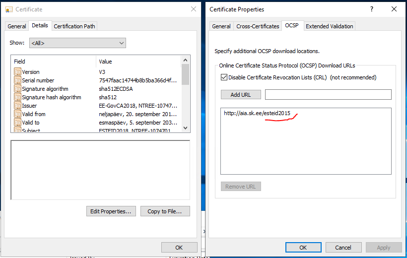

> **Note:** I repeat here for clarity: certificates issued by `ESTEID2018` / `ESTEID2025` CA have AIA OCSP path described in certificate. CRL is not described for those certificates.

> **Note:** Windows server by default changes from OCSP based revocation check to CRL based revocation checking after 50 OCSP queries. In our configuration, this doesn't really matter since we don't use CRL at all. For other configurations I mention here that we can change this behavior by changing registry value of registry key `HKEY_LOCAL_MACHINE/Software/Policies/Microsoft/SystemCertificates/ChainEngine/Config/CryptnetCachedOcspSwitchToCrlCount`. For more information take a look at [OCSP magic count](https://learn.microsoft.com/en-us/previous-versions/windows/it-pro/windows-server-2008-R2-and-2008/ee619754(v=ws.10)#determining-preference-between-ocsp-and-crls) or *magic number*. We can also change the behavior with windows policy:

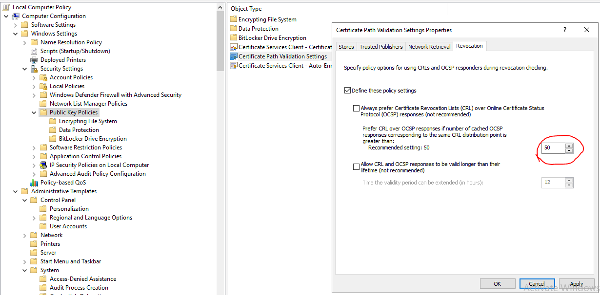

### Recommended security settings for IIS

#### SSL/TLS

IIS version 10 is using TLS protocol versions from 1.0 to 1.3 by default[^4]. Older SSL versions are disabled by default.

Old unsecure SSL/TLS protocols with version number lower than `TLS 1.2` should definitely no longer be used. `TLS 1.2` should be the lowest version to use! From Windows Server version 2022 `TLS 1.3` is also available. If you need one-way SSL, it can be a good idea to enable only `TLS 1.3`!

More information about the recommendations for the use of the TLS protocol can be found in the cryptographic algorithms life cycle reports ordered by RIA at <https://www.id.ee/en/article/cryptographic-algorithms-life-cycle-reports-2/>.

In addition to disabling older TLS versions in IIS management console, we can disable `TLS 1.0` and `TLS 1.1` in registry keys by defining following values[^5]:

- `HKEY_LOCAL_MACHINE\SYSTEM\CurrentControlSet\Control\SecurityProviders\SCHANNEL\Protocols\`[^6]:
  - `TLS 1.0\Server`
    - `Enabled DWORD:0`
    - `DisabledByDefault = DWORD:1`
  - `TLS 1.1\Server`
    - `Enabled DWORD:0`
    - `DisabledByDefault = DWORD:1`

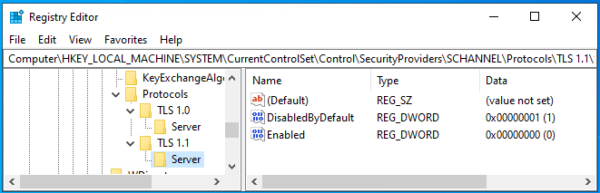

Of course, it is also possible to deploy TLS/SSL versions settings through group policy by deploying registry settings.

#### Cipher suites

There are many different cipher suites available with Windows Server. We can list available cipher suites with `PowerShell` command `Get-TLSCipherSuite`[^7].

It is impossible to give an exact recommendation for configuring cipher suites because different environments have different requirements. And requirements and possibilities are changing in time. The only recommendation we can give here is to remove non-secure cipher suites from the list if any exist. Before going on with configuring cipher suites, we recommend getting acquainted with RIA's recommendations for the use of the cipher suites in the cryptographic algorithms life cycle report at <https://www.id.ee/en/article/cryptographic-algorithms-life-cycle-reports-2/>. It can make sense to enable only specific cipher combinations.

So, if we want to configure specific cipher suites, the best way to do it is probably using local or group policy. To configure cipher suites `ECDHE-ECDSA-AES256-GCM-SHA384` and `ECDHE-RSA-AES256-GCM-SHA384` as only ones in our configuration, we must modify policy setting `Computer Configuration/Administrative Templates/Network/SSL Configuration Settings: SSL Cipher Suite Order`. Cipher suites must be separated with comma.[^8]

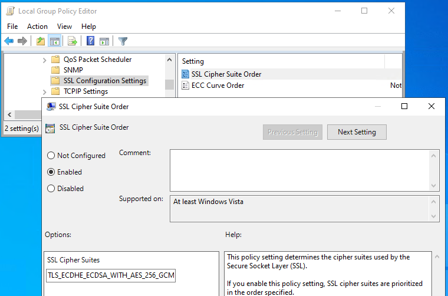

Assigned configuration can be found from registry location presented on the following picture:

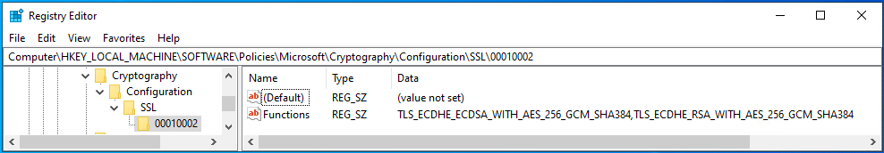

Default configuration settings can be found from registry location presented on the following picture:

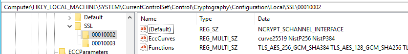

##### Other configurable Schannel settings

Default location for all Schannel settings is `HKLM\SYSTEM\CurrentControlSet\Control\SecurityProviders\SCHANNEL`. It is possible to enable or disable different Schannel components here, overwrite default configuration.

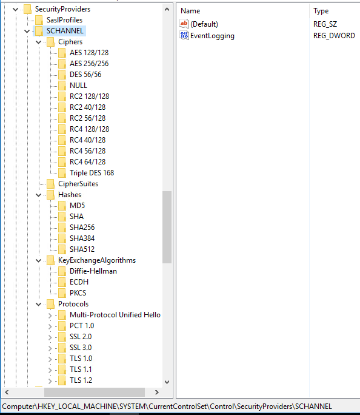

#### Additional possibilities

In addition to TLS and cipher suite configuration there are many other things we can do to secure our server:

- Keep operating system up to date.
- Disable presenting server information.
- Disable HTTP requests.
- Disable directory listing.
- Run under separate non-system and non-administrator accounts.
- Enable HSTS.
- …

Please take the list above as a short demo recommendations list. Of course, it makes sense to follow the recommendations, but there can be much more you can do to secure your server:

<https://www.google.com/search?q=how+to+secure+IIS+server>

[^1]: <https://www.id.ee/en/article/install-id-software/>

[^2]: If certificate is issued by intermediate CA, it must be in `Intermediate Certification Authorities` container. In this case root CA certificate for intermediate CA must be in `Trusted Root Certification Authorities` container.

[^3]: To support EID cards issued for organizations by SK ID Solutions, we must add to the list also `EID-SK 2016` (<https://www.sk.ee/upload/files/EID-SK_2016.der.crt>) certificates!

[^4]: <https://docs.microsoft.com/en-us/windows/win32/secauthn/protocols-in-tls-ssl--schannel-ssp-?redirectedfrom=MSDN>

[^5]: These entries do not exist in the registry by default.

[^6]: It is also possible to configure client part for SSL/TLS versions, but currently we are talking about server configuration. It does not mean that configuring client part is not recommended, it just depends.

[^7]: <https://docs.microsoft.com/en-us/windows/win32/secauthn/cipher-suites-in-schannel>

[^8]: With cipher settings described here `TLS 1.3` will not work. So, those settings can be useful if we don't want to use `TLS 1.3` for any reason, for enabling certificate authentication for example.
