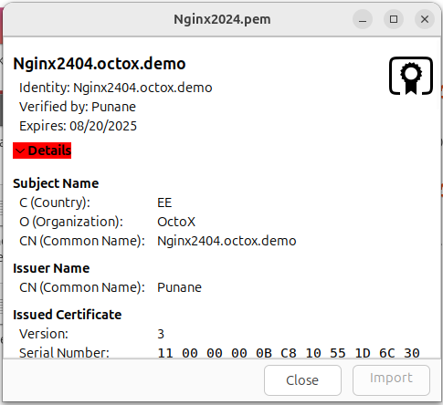
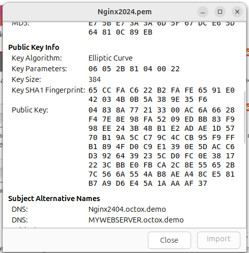
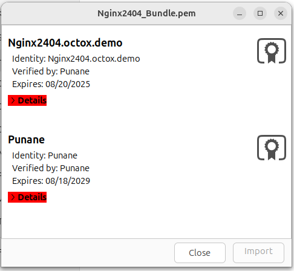
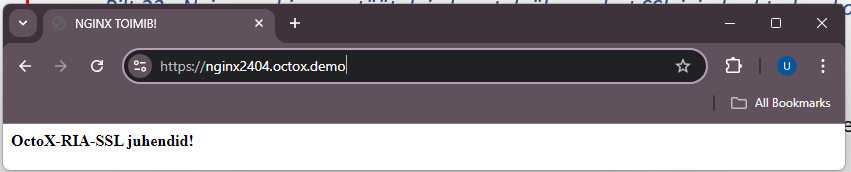
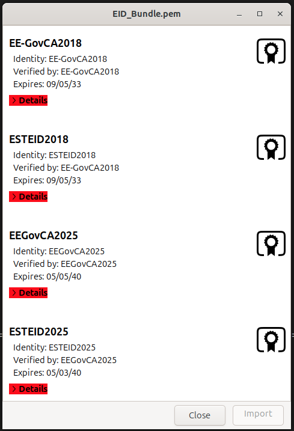
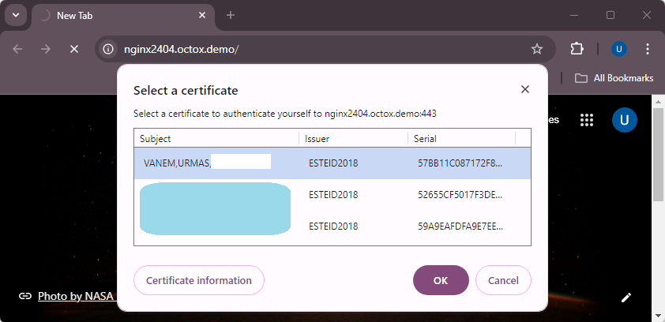

# Ubuntu Nginx veebiserveri kahepoolse SSLi häälestus Eesti ID‑kaartide vaates

**[In English](index.md)**

**Versioon:** 26.04/1

**Väljaandja:** [RIA](https://www.ria.ee/)

**Versiooni info**

| Kuupäev    | Versioon | Muutused/märkused
|:-----------|:--------:|:-----------------------------------------------------------
| 08.02.2019 | 19.02/1  | Avalik versioon.
| 28.02.2019 | 19.02/2  | Lisatud märkused kasutaja sertifikaatide kehtivuse kontrolli kohta. Vaikimisi veebilehe eemaldamine. — Muutja: Urmas Vanem
| 12.12.2019 | 19.12/1  | Lisatud Nginx soovituslikud turvasätted. — Muutja: Urmas Vanem
| 30.12.2020 | 20.12/1  | Ubuntu uuendatud versioonile 20.04.1. Nginx uuendatud versioonile 1.19.6. Muudetud konfiguratsiooni haldamine (sites-... -> conf.d). Lisatud OCSP-põhiste tühistusnimekirjade kasutamise võimalus, soovituslikud turvasätted ja valede CAde sertifikaatide blokeerimise kirjeldus. — Muutja: Urmas Vanem
| 13.01.2021 | 21.01/1  | Lisatud demo-konfiguratsiooni fail. Lisatud HSTS konfiguratsioon. — Muutja: Urmas Vanem
| 25.01.2021 | 21.01/2  | Muudetud HSTS, SSL/TLS ja šifrite kasutamise soovitusi, lisatud täiendava turvalisuse tõstmise soovitused. — Muutja: Urmas Vanem
| 28.04.2021 | 21.04/1  | Eemaldatud aegunud `ESTEID-SK 2011` sertifikaatide tugi. — Muutja: Urmas Vanem
| 25.11.2021 | 21.11/1  | Uuendatud Ubuntu platvorm versioonile Ubuntu Server 21.10 ja Nginx platvorm versioonile 1.21.4, lisatud ECC sertifikaatide loomine veebiserveril, täiendatud TLS ja Cipher soovitusi. — Muutja: Urmas Vanem
| 22.02.2023 | 23.02/1  | Ubuntu uuendatud versioonile Ubuntu Server 22.04 ja Nginx versioonile 1.23.3, uuendatud on ka virtuaalhosti konfiguratsioon. — Muutja: Urmas Vanem
| 18.12.2023 | 23.12/1  | Eemaldatud `ESTEID-SK 2015` ahel. — Muutja: Urmas Vanem
| 22.08.2024 | 24.08/1  | Ubuntu uuendatud versioonile Ubuntu Server 24.04 ja Nginx versioonile 1.27.1. — Muutja: Urmas Vanem
| 31.10.2025 | 25.10/1  | Lisatud Zetes ahelad, eemaldatud SK OCSP lõik. — Muutja: Lauris Kaplinski
| 22.04.2026 | 26.04/1  | Konverteeritud Markdown formaati. — Muutja: Raul Metsma

---

- TOC
{:toc}

## Sissejuhatus

Käesolevas juhendis kirjeldatakse:

- Kuidas paigaldada ja häälestada Nginx 1.28.1 veebiserver Ubuntu 24.04 serveril.
- Kuidas häälestada HTTPS (ühepoolne SSL) veebiserveril.
- Kuidas häälestada [SK ID Solutions](https://www.skidsolutions.eu/resources/certificates/) (`EE-GovCA2018`) ja [Zetes](https://repository.eidpki.ee/) (`EEGovCA2025`) ID-kaartidega autentimine (kahepoolne SSL) veebiserveril.
- Kuidas häälestada OCSP kontroll nii vastu garanteeritud kui AIA OCSP teenust.
- Kuidas turvata oma veebiserverit.

Lisaks on käsitletud muid konfiguratsioonivõimalusi, nt kuidas HTTP liiklus suunata HTTPS kanalisse jpm.

## Nginx paigaldus ja häälestus

### Paigaldus

Ubuntu 24.04 versiooni puhul paigaldatakse vaikimisi juhiste puhul Nginx versioon 1.24. Kuna aga soovime oma demojuhendis kasutada viimast versiooni 1.28.1, siis tuleb enne paigaldust teha täiendavaid muudatusi.

Nginx versiooni 1.28.1 paigaldamiseks Ubuntu versioonile 24.04 tuleb teha järgmised sammud:

1.  Käivita terminalis käsk

    ```bash
    $ sudo add-apt-repository ppa:ondrej/nginx
    PPA publishes dbgsym, you may need to include 'main/debug' component
    Repository: 'Types: deb
    URIs: https://ppa.launchpadcontent.net/ondrej/nginx/ubuntu/
    Suites: noble
    Components: main
    '

    Description:
    This branch follows latest NGINX Stable packages compiled against latest OpenSSL for HTTP/2 and TLS 1.3 support.

    BUGS&FEATURES: This PPA now has a issue tracker: https://deb.sury.org/#bug-reporting
    ```

2.  Käivita terminalis käsk

    ```bash
    $ apt update
    Hit:1 http://ee.archive.ubuntu.com/ubuntu noble InRelease
    Hit:2 http://ee.archive.ubuntu.com/ubuntu noble-updates InRelease
    Hit:3 http://ee.archive.ubuntu.com/ubuntu noble-backports InRelease
    Hit:4 http://security.ubuntu.com/ubuntu noble-security InRelease
    Hit:5 https://ppa.launchpadcontent.net/ondrej/apache2/ubuntu noble InRelease
    Hit:6 https://ppa.launchpadcontent.net/ondrej/nginx-mainline/ubuntu noble InRelease
    ```

3.  Käivita terminalis käsk

    ```bash
    $ apt install nginx-full
    Reading package lists... Done
    Building dependency tree... Done
    Reading state information... Done
    The following additional packages will be installed:
      libnginx-mod-http-auth-pam libnginx-mod-http-dav-ext libnginx-mod-http-echo
      libnginx-mod-http-geoip2 libnginx-mod-http-subs-filter
      libnginx-mod-http-upstream-fair libnginx-mod-stream
      libnginx-mod-stream-geoip2 nginx nginx-common
    ```

Nginx versiooni saab kontrollida ka käsuga

```bash
$ nginx -v
nginx version: nginx/1.28.1
```

### Konfiguratsioon

#### Ühepoolse SSLi lubamine

##### SSL sertifikaadi privaatvõtme ja päringufaili (CSR) loomine

###### ECC (*Elliptic Curve Cryptography*)

Esmalt genereeri ECC privaatvõti, seejärel ECC CSR[^1]:

```bash
$ openssl ecparam -name secp384r1 -genkey -noout -out Nginx2404.key
$ openssl req -new -key Nginx2404.key -out Nginx2404.csr -subj /C=EE/O=OctoX/CN=Nginx2404.octox.demo -reqexts SAN -config <(cat /etc/ssl/openssl.cnf <(printf "[SAN]\nsubjectAltName=DNS:Nginx2404.octox.demo,DNS:MYWEBSERVER.octox.demo"))
```

1.  `Nginx2404.key` on sertifikaadi privaatvõti;
2.  `Nginx2404.csr` on sertifikaadi päringufail, mis edastatakse sertifitseerimiskeskusele;
3.  `CN=Nginx2404.octox.demo` on väljastatava sertifikaadi *common name;*
4.  `DNS:Nginx2404.octox.demo` ja `DNS:MYWEBSERVER.octox.demo` on sertifikaadil olevad SAN DNS nimed, mis peavad kindlasti vastama veebilehe tegelikule aadressile[^2]. Need nimed peavad ka nimeserveris lahenema.

Loodud sertifikaadi päringufaili sisu on võimalik vaadata käsuga

```bash
$ openssl req -in Nginx2404.csr -noout -text
Certificate Request:
    Data:
        Version: 1 (0x0)
        Subject: C = EE, O = OctoX, CN = Nginx2404.octox.demo
        Subject Public Key Info:
            Public Key Algorithm: id-ecPublicKey
                Public-Key: (384 bit)
                pub:
                    04:83:8a:77:21:33:00:ac:6a:66:28:f4:7e:8e:98:
                    fa:52:09:ed:bb:83:f9:98:ee:24:3b:48:b1:e2:ad:
                    ae:1d:57:70:b1:9a:5c:c7:9c:4c:cb:95:f9:ff:b1:
                    89:4f:d0:c9:e1:39:0e:5d:ac:c6:d3:92:64:39:23:
                    5c:d0:fc:0e:38:17:22:3c:bb:e0:fb:ca:2c:8e:55:
                    65:2b:7c:56:6a:55:4a:b8:ae:a4:8c:e5:81:b7:a9:
                    d6:e4:5a:1a:aa:af:37
                ASN1 OID: secp384r1
                NIST CURVE: P-384
        Attributes:
            Requested Extensions:
                X509v3 Subject Alternative Name:
                    DNS:Nginx2404.octox.demo, DNS:MYWEBSERVER.octox.demo
        Signature Algorithm: ecdsa-with-SHA256
        Signature Value:
```

###### RSA

*See lõik on säilitatud neile, kes eelistavad RSA-põhiseid sertifikaate. Ülejäänud juhend kasutab ECC-d.*

Loo sertifikaadi päring ja privaatvõti käsuga

```bash
$ openssl req -newkey rsa:2048 -keyout NGINX20PRIV.key -sha256 -subj "/CN=Nginx20.kaheksa.xi" -reqexts SAN -config <(cat /etc/ssl/openssl.cnf <(printf "[SAN]\nsubjectAltName=DNS: Nginx20.kaheksa.xi,DNS: Nginx22.kaheksa.xi ")) -out NGINX20.csr -nodes
Generating a RSA private key
........................................................................+++++
.....................................+++++
writing new private key to 'NGINX20PRIV.key'
-----
```

1.  `NGINX20PRIV.key` on sertifikaadi privaatvõti;
2.  `NGINX20.csr` on sertifikaadi päringufail, mis edastatakse sertifitseerimiskeskusele;
3.  `Nginx20.kaheksa.xi` on väljastatava sertifikaadi subjekt;
4.  `Nginx20.kaheksa.xi` ja `Nginx22.kaheksa.xi` on sertifikaadil olevad SAN DNS nimed, mis peavad kindlasti vastama veebilehe tegelikule aadressile[^3]. Need nimed peavad ka nimeserveris lahenema (piisab ka ühest nimest).

Loodud sertifikaadi päringufaili sisu on võimalik vaadata käsuga

```bash
$ openssl req -in NGINX20.csr -noout -text
Certificate Request:
    Data:
        Version: 1 (0x0)
        Subject: CN = Nginx20.kaheksa.xi
        Subject Public Key Info:
            Public Key Algorithm: rsaEncryption
                RSA Public-Key: (2048 bit)
                Modulus:
                    00:f1:62:c3:ed:1d:0b:ea:cb:7c:22:17:41:1e:e3:
                    c1:02:a6:7b:f3:72:13:ae:8d:72:72:6f:09:77:d6:
                    51:84:4b:2a:f6:7b:65:9d:9f:f3:2a:0c:16:e5:26:
                    47:70:aa:3e:c8:4c:50:62:5b:6c:2a:49:ea:51:01:
                    60:5c:94:2c:d6:1d:78:70:eb:41:88:6c:09:c8:2f:
                    e4:d5:bb:2f:fb:ec:2f:9d:0c:42:66:b5:de:91:e3:
                    60:62:ff:94:11:21:aa:de:bb:52:bd:20:a6:ff:b4:
                    c3:92:0a:5b:b5:fc:2f:88:bc:44:3e:b4:5b:a4:ec:
                    de:49:16:b6:c0:13:ed:d0:e2:ee:d0:58:bc:cb:36:
                    32:c9:1b:6d:8f:79:db:83:22:fd:fe:a7:9a:b2:cd:
                    26:b1:d7:52:c4:0c:40:6d:0e:49:b5:18:07:c2:3c:
                    c0:c9:70:5d:06:da:0a:e6:01:1a:a4:78:19:aa:a7:
                    38:1c:9d:36:07:4d:db:d2:b5:7b:50:f1:4b:d0:c7:
                    5d:90:86:92:2d:a6:ea:d7:d2:09:8f:51:e8:b6:52:
                    07:b1:1e:5e:ca:65:f3:d4:69:52:f1:d9:47:02:24:
                    98:42:70:83:bc:49:13:c1:92:51:f7:ca:b2:fa:f6:
                    a7:08:13:c1:74:23:d6:58:ab:27:d5:e5:02:20:3f:
                    11:3b
                Exponent: 65537 (0x10001)
        Attributes:
            Requested Extensions:
                X509v3 Subject Alternative Name:
                    DNS:Nginx20.kaheksa.xi, DNS: Nginx22.kaheksa.xi
        Signature Algorithm: sha256WithRSAEncryption
```

##### SSL sertifikaadi tellimine ja paigaldamine

Järgnevalt tuleb saata sertifikaadi päringufail `Nginx2404.csr` mõnele usaldusväärsele sertifitseerimiskeskusele allkirjastamiseks. Näidiskonfiguratsiooni tingimustes on sertifikaadi väljastajaks testkeskkonna sertifitseerimiskeskus. Allkirjastatud sertifikaat väljastatakse PEM formaadis:

```
-----BEGIN CERTIFICATE-----
MIICfjCCAZygAwIBAgITEQAAAAvIEFUdbDDF...
...
Hz3/vZjy73t2ag==
-----END CERTIFICATE-----
```

Avades sertifikaadi Ubuntu failihalduris on näha järgmist:



Sertifikaadis on kirjas ka algoritm ja alternatiivsed subjekti DNS nimed:



Nagu näha, on sertifikaadi väljaandjaks sertifitseerimiskeskus nimega `Punane`. Nüüd tuleb hankida väljaandja CA sertifikaat PEM formaadis ja salvestada see kasutaja kodukausta nimega `Punane.pem`.

Koonda kõik ühepoolse SSL-i sertifikaadid ühte faili nii, et veebiserveri sertifikaat oleks esimene. Käesolevas näites tähendab see `Nginx2404.pem`-i, millele järgneb CA sertifikaat `Punane.pem`. Seda saab teha tekstiredaktoris (asetades Base64-kodeeritud sertifikaadid üksteise järele) või käsuga

```bash
$ cat Nginx2404.pem Punane.pem >Nginx2404_Bundle.pem
```

Ubuntus avades näeb koondfail välja järgmine:



Sertifikaatide koondfaili `Nginx2404_Bundle.pem` tuleb kopeerida kausta `/etc/ssl/certs`. Lisaks peab
paigaldama ka sertifikaadi privaatvõtme kausta `/etc/ssl/private`.

```bash
$ cp Nginx2404_Bundle.pem /etc/ssl/certs
$ cp Nginx2404.key /etc/ssl/private
```

Nüüd on Nginx serveripoolsed sertifikaadid korrektselt failisüsteemi paigaldatud.

#### Virtuaalse veebilehe loomine

Loo enda konfiguratsioonile eraldiseisev virtuaalne veebileht. Esmalt tuleb luua kaust `/var/www/Nginx2404`, kuhu paigaldada veebilehe sisu.

```bash
$ mkdir /var/www/Nginx2404
```

Paigalda loodud kausta mõni lihtne ja äratuntav veebileht nimega `index.html`.

Järgmiseks tee valmis virtuaalse veebilehe konfiguratsioonifail. Tee uus fail nimega `/etc/nginx/conf.d/Nginx2404.conf` (näiteks käsuga `nano /etc/nginx/conf.d/Nginx2404.conf`).

Nüüd muuda uut konfiguratsioonifaili vastavalt oma soovidele. Lisa sinna järgmine sisu[^4]:

```nginx
server {
    listen 80;
    listen [::]:80;
    server_name Nginx2404.octox.demo;
    return 301 https://Nginx2404.octox.demo;
}

server {
    # SSL configuration
    listen 443 ssl;
    listen [::]:443 ssl;
    root /var/www/Nginx2404;
    index index.html;
    server_name Nginx2404.octox.demo;

    # Certificates
    ssl_certificate /etc/ssl/certs/Nginx2404_Bundle.pem;
    ssl_certificate_key /etc/ssl/private/Nginx2404.key;

    location / {
        try_files $uri $uri/ =404;
    }
}
```

Konfiguratsiooni süntaksit saab kontrollida käsuga `nginx -t`. Kui vigu ei ole, käivita Nginx teenus:

```bash
$ systemctl start nginx
```

Kui teenus juba töötab, saab muudatused rakendada käsuga

```bash
$ systemctl reload nginx
```

#### Tulemus

Nüüd saab veebilehe poole pöördumiseks kasutada ühepoolset SSLi. Samuti suunatakse automaatselt aadressilt <http://Nginx2404.octox.demo> aadressile <https://Nginx2404.octox.demo>.



#### Kahepoolse sertifikaadinõude (SSLi) kehtestamine

Eesti ID-kaardiga autentimise lubamiseks tuleb olemasolevat konfiguratsiooni pisut täiendada.

Lisa järgmised read `Nginx2404.conf` faili SSL sektsiooni, pärast `ssl_certificate_key` rida:

```nginx
# Certificates
ssl_certificate /etc/ssl/certs/Nginx2404_Bundle.pem;
ssl_certificate_key /etc/ssl/private/Nginx2404.key;
ssl_client_certificate /etc/ssl/certs/EID_Bundle.pem;
ssl_verify_client on;
ssl_verify_depth 2;
```

Nüüd tuleb luua uus tekstifail [`EID_Bundle.pem`](#eid_bundle.pem), kuhu tuleb lisada eID juur- ja kesktaseme sertifikaadid Base64 kodeeritud kujul (`EE-GovCA2018`, `ESTEID2018`, `EEGovCA2025`, `ESTEID2025`). Selle faili abil saab välja filtreerida kõik sertifitseerimiskeskused, mille alt väljastatud sertifikaate uus veebileht toetab. Kasutajale näidatakse vaid neid sertifikaate, mis on väljastatud eelloetletud ahelatest. Faili loomiseks saab kasutada cat käsku, aga töötab ka kopeeri-ja-kleebi tekstiredaktorite vahel. Ubuntus avatuna näeb fail välja järgmine:



Salvesta loodud faili nimega [`EID_Bundle.pem`](#eid_bundle.pem) ja kopeeri see kausta `/etc/ssl/certs`. Veebiserveris muudatuse jõustumiseks taaskäivita Nginx:

```bash
$ systemctl reload nginx
```

Pöördudes pärast muudatuse jõustumist uuesti veebilehe `Nginx2404.octox.demo` poole, küsitakse kasutaja sertifikaati.



Server pakub kasutajale välja sertifikaadid, mille väljastajad on kirjeldatud failis [`EID_Bundle.pem`](#eid_bundle.pem). Pärast sertifikaadi kinnitamist ja PIN-koodi sisestamist lubatakse kasutaja veebilehele - kahepoolne SSL töötab.

Käesoleva dokumendi kõiki sätteid koondav demo-konfiguratsioonifail on saadaval [lisas](#nginx_eid_demo.conf).

## Võimalikud lisakonfiguratsioonid

Käesoleva dokumendi eesmärk ei ole anda täpseid juhiseid optimaalseks veebilehtede konfigureerimiseks ega turvamiseks, vaid tutvustada konfiguratsiooni kahepoolse SSLi kasutamiseks Eesti ID-kaartidega. Siiski on oluline arvestada allolevaga.

### Tulemüüri reegli loomine (vajadusel)

Tulemüüri reegli loomiseks tuleb terminalis käivitada käsk:

```bash
$ ufw allow 'SOOVITAV REEGEL'
```

Näiteks ainult HTTPS liikluse lubamiseks tuleb käivitada

```bash
$ ufw enable
Firewall is active and enabled on system startup
$ ufw allow 443/tcp
Rule added
Rule added (v6)
```

Kui tulemüüri staatus on aktiivne (`ufw enable`), siis päring `ufw status` näitab olemasolevaid reegleid.

```bash
$ ufw status
Status: active

To                         Action      From
--                         ------      ----
443/tcp                    ALLOW       Anywhere
443/tcp (v6)               ALLOW       Anywhere (v6)
```

### Kasutaja sertifikaadi staatuse kontroll OCSP teenuse vastu[^5]

OCSP (*Online Certificate Status Protocol*) teenuse abil saab kasutaja sertifikaadi staatust kontrollida reaalajas. Iga kasutaja autentimisel saadab veebiserver päringu OCSP teenusele, mis tagastab sertifikaadi staatuse info.

SK ja Zetes pakuvad vaba ligipääsuga (tasuta) AIA OCSP teenust. `ESTEID2018` ja `ESTEID2025` CA alt väljastatud sertifikaatide puhul on AIA OCSP aadress juba sertifikaadis kirjas (<http://aia.sk.ee/esteid2018>, <http://ocsp.eidpki.ee>).


Lubamaks kasutaja sertifikaadi staatuse kontrolli vastu sertifikaadis olevat AIA OCSP teenust, tuleb Nginx SSL konfiguratsiooni lisada järgmised read pärast `ssl_verify_depth` rida:

```nginx
# Certificates
ssl_certificate /etc/ssl/certs/Nginx2404_Bundle.pem;
ssl_certificate_key /etc/ssl/private/Nginx2404.key;
ssl_client_certificate /etc/ssl/certs/EID_Bundle.pem;
ssl_verify_client on;
ssl_verify_depth 2;
ssl_ocsp leaf;
ssl_ocsp_cache off;
resolver 194.126.115.18;
```

Ülaltoodud konfiguratsiooni puhul võetakse OCSP teenuse aadress kasutaja sertifikaadist. Asendage `resolver` IP-aadress avaliku DNS-serveri IP-aadressiga[^6].

### Soovituslikud Nginxi turvasätted

#### SSL/TLS

Ubuntu platvormil töötav Nginx server versiooniga 1.23.3 võib toetada aegunud TLS versioone nagu TLS 1.0 või TLS 1.1. Tänapäeval on tungivalt soovitav mitte kasutada TLS protokolli versioonist 1.2 madalamaid versioone. Juba mõnda aega on kasutusel ka TLS versioon 1.3.

Kui puudub spetsiifiline nõue TLS 1.2 versiooni lubamiseks, siis on soovitav kasutada vaid TLS versiooni 1.3. TLS 1.2 on küll korrektse konfiguratsiooni puhul väga stabiilne ja turvaline, ent TLS 1.3 on kiirem, vaikimisi turvalisem ja nõuab vähem konfigureerimist. Standardlahendustes võiks TLS 1.2 olla toetatud vaid tõestatud vajaduse puhul ja sel juhul tuleb olla veendunud, et kasutusel on vaid turvalised šifrikomplektid ja laiendused.

Kui on soov Nginx serveris kasutada vaid TLS protokolli versiooni 1.3, tuleb konfiguratsioonifaili lisada rida:

```nginx
ssl_protocols TLSv1.3;
```

Toetamaks ka TLS versiooni 1.2, tuleb konfiguratsioonireale lisada `TLSv1.2`.

Sama muudatuse serveri tasemel kehtestamiseks muuda `ssl_protocols` direktiivi failis `/etc/nginx/nginx.conf`.

Rohkem infot TLS protokolli kasutamise soovituste kohta leiab RIA tellitud krüptograafiliste algoritmide elutsükli uuringust aadressil <https://www.id.ee/artikkel/kruptograafiliste-algoritmide-elutsukli-uuringud-2/>.

#### Šifrikomplektid (*Cipher suites*)

TLS 1.3 versiooni kõiki šifreid peetakse hetkeseisuga turvaliseks, seega turvakaalutlustel selle protokolli jaoks lisakonfiguratsiooni looma ei pea.

TLS 1.2 puhul see päris nii ei ole. Nginx 1.23.3 versiooniga on vaikimisi kasutusel suur hulk erinevaid TLS šifreid[^7], mida näeb käsuga

```bash
$ openssl ciphers -v
```

Kui on soov määrata täpsemalt TLS 1.2 protokolliga kasutatavaid šifrikomplekte, saab Nginx kaustapõhises konfiguratsioonifailis kasutada direktiivi `ssl_ciphers`. Siin omakorda saab kasutada kas eeldefineeritud *alias*i või täpseid šifrikomplektide kirjeldusi.

Kindlat soovitust erinevate šifrikomplektide kasutamiseks ei ole võimalik anda ilma veebilehele esitatavaid tingimusi teadmata. Küll aga tuleb kindlasti eemaldada loendist ebaturvalised šifrikomplektid. Mõistlik on kirjeldada konkreetsed lubatud šifrikomplektid TLS 1.2 kasutamiseks.

Näide — järgnev rida konfiguratsioonifailis lubab vaid loetletud šifrikomplektide kasutamist:

```nginx
ssl_ciphers ECDHE-ECDSA-AES256-GCM-SHA384:ECDHE-RSA-AES256-GCM-SHA384;
```

Alternatiivina saab kasutatavaid šifreid konfigureerida serveripõhiselt failis `/etc/nginx/nginx.conf` muutes selles parameetrit `ssl_ciphers`.

Rohkem infot šifrikomplektide soovituste kohta leiab RIA tellitud krüptograafiliste algoritmide elutsükli uuringust aadressil <https://www.id.ee/artikkel/kruptograafiliste-algoritmide-elutsukli-uuringud-2/>.

##### ssl_prefer_server_ciphers

Eelistamaks serveri šifrikomplektide valikut kasutaja omale, tuleb Nginx konfiguratsioonifailis defineerida määrang `ssl_prefer_server_ciphers` ja panna selle väärtuseks `on`.

#### Kasutajasertifikaatide lisafiltreerimine

Oluline! Veebiteenusele juurdepääsu piiramiseks vaid õigete sertifikaatidega kasutajatele tuleb serveri konfiguratsioonis kehtestada järgmised nõuded:

1.  sertifikaadis peab olema korrektne OID väärtus;
2.  sertifikaadi väljastaja peab olema `ESTEID2018` või `ESTEID2025`.

Hetkeseisuga ei ole teada ühtki meetodit õige OID kontrollimiseks Nginx serveri tasemel. Seetõttu on soovitatav see kontroll teha veebirakenduse tasemel.

Teise nõude täitmiseks saab luua konfiguratsiooni, kus ühendus katkestatakse, kui sertifikaat ei ole väljastatud serveris lubatud CAde poolt. Selleks tuleb lisada konfiguratsioonifaili (serveri sektsiooni, näiteks SSL kirjeldusele järgnevalt) järgmised tingimused:

```nginx
#Determine IMCA and cancel, if not trusted
set $ocspr "";

if ($ssl_client_i_dn = "CN=ESTEID2018,organizationIdentifier=NTREE-10747013,O=SK ID Solutions AS,C=EE") {
    set $ocspr "http://aia.sk.ee/esteid2018";
}

if ($ssl_client_i_dn = "CN=ESTEID2025, organizationIdentifier=NTREE-17066049, O=Zetes Estonia OÜ, C=EE") {
    set $ocspr "http://ocsp.eidpki.ee";
}

if ($ocspr = "") {
    return 403;
}
```

Nende tingimuste lisamisel lükatakse ühendus tagasi, kui kasutaja sertifikaati ei ole väljastanud usaldusväärne CA — `ESTEID2018` või `ESTEID2025`.

> **Märkus:** Kui on kasutusel mõni muu liikluse filtreerimise vahend/võimalus, siis on soovitav turvaline konfiguratsioon juurutada ka seal. SK on F5 konfiguratsiooni osas publitseerinud järgmise informatsiooni (vt. peakükki „Only accept certificates with trusted key usage"): <https://github.com/SK-EID/smart-id-documentation/wiki/Secure-Implementation-Guide>

> **Märkus:** SK soovitused turvaliseks autentimiseks ID-kaardiga on leitavad peatükist „Defence: implement ID-card authentication securely": <https://github.com/SK-EID/smart-id-documentation/wiki/Secure-Implementation-Guide>

> **Märkus:** Soovituslik meetod ebakorrektsete sertifikaatide vältimiseks on kasutada sertifikaatides olevaid OIDe. Paraku ei ole hetkeseisuga teada meetodit, kuidas seda serveri tasemel teha. Võimalusel tuleks võtta autentimise sertifikaat veebirakenduse tasemel lahti ja kontrollida, kas see sisaldab mõnda korrektset OIDi ning kui ei sisalda, siis mitte autentida. Hetkeseisuga teadaolevad OIDid on SK publitseerinud peatükis „Only accept certificates with trusted issuance policy": <https://github.com/SK-EID/smart-id-documentation/wiki/Secure-Implementation-Guide>

#### *HTTP Strict Transport Security* (HSTS) lubamine

HSTS teenuse Nginx veebilehele konfigureerimiseks lisa konfiguratsioonifaili rida `add_header Strict-Transport-Security`:

```nginx
# Other recommended security and optimization settings.
ssl_prefer_server_ciphers on;
add_header Strict-Transport-Security "max-age=31536000; includeSubDomains; preload" always;
ssl_session_cache    shared:SSL:10m;
ssl_session_timeout  1h;
ssl_session_tickets  on;
```

#### Muud võimalused

Lisaks TLS ja šifrikomplektide häälestusele on soovitav pöörata tähelepanu Nginx serveri turvalisusele ka järgmiste punktide vaates:

- Hoida operatsioonisüsteem uuendatuna.
- Hoida Nginx uuendatuna.
- Keelata serveri info presenteerimine.
- Keelata HTTP päringud.
- Paigaldada ja konfigureerida Naxsi.
- Monitoorida Monit abil.
- Konfigureerida X-XSS kaitse.
- Konfigureerida X-Frame-Options.
- Konfigureerida X-Content-Type-Options.
- Konfigureerida Content Security Policy (CSP).
- ...

Ülaltoodu on näidisloend võimalustest Nginx turvalisemaks muutmiseks. Põhjalikumaid soovitusi on võimalik leida internetist: <https://www.google.com/search?q=how+to+secure+nginx+server>.

## Lisa

### EID_Bundle.pem

```
# EE-GovCA2018
-----BEGIN CERTIFICATE-----
MIIE+DCCBFmgAwIBAgIQMLOwlXoR0oFbj52nmRsnezAKBggqhkjOPQQDBDBaMQsw
CQYDVQQGEwJFRTEbMBkGA1UECgwSU0sgSUQgU29sdXRpb25zIEFTMRcwFQYDVQRh
DA5OVFJFRS0xMDc0NzAxMzEVMBMGA1UEAwwMRUUtR292Q0EyMDE4MB4XDTE4MDkw
NTA5MTEwM1oXDTMzMDkwNTA5MTEwM1owWjELMAkGA1UEBhMCRUUxGzAZBgNVBAoM
ElNLIElEIFNvbHV0aW9ucyBBUzEXMBUGA1UEYQwOTlRSRUUtMTA3NDcwMTMxFTAT
BgNVBAMMDEVFLUdvdkNBMjAxODCBmzAQBgcqhkjOPQIBBgUrgQQAIwOBhgAEAMcb
/dmAcVo/b2azEPS6CfW7fEA2KuHKC53D7ShVNvLz4QUjCdTXjds/4u99jUoYEQec
luVVzMlgEJR1nkN2eOrLAZYxPjwG5HiI1iZEyW9QKVdeEgyvhzWWTNHGjV3HdZRv
7L9o4533PtJAyqJq9OTs6mjsqwFXjH49bfZ6CGmzUJsHo4ICvDCCArgwEgYDVR0T
AQH/BAgwBgEB/wIBATAOBgNVHQ8BAf8EBAMCAQYwNAYDVR0lAQH/BCowKAYIKwYB
BQUHAwkGCCsGAQUFBwMCBggrBgEFBQcDBAYIKwYBBQUHAwEwHQYDVR0OBBYEFH4p
Vuc0knhOd+FvLjMqmHHB/TSfMB8GA1UdIwQYMBaAFH4pVuc0knhOd+FvLjMqmHHB
/TSfMIICAAYDVR0gBIIB9zCCAfMwCAYGBACPegECMAkGBwQAi+xAAQIwMgYLKwYB
BAGDkSEBAQEwIzAhBggrBgEFBQcCARYVaHR0cHM6Ly93d3cuc2suZWUvQ1BTMA0G
CysGAQQBg5EhAQECMA0GCysGAQQBg5F/AQEBMA0GCysGAQQBg5EhAQEFMA0GCysG
AQQBg5EhAQEGMA0GCysGAQQBg5EhAQEHMA0GCysGAQQBg5EhAQEDMA0GCysGAQQB
g5EhAQEEMA0GCysGAQQBg5EhAQEIMA0GCysGAQQBg5EhAQEJMA0GCysGAQQBg5Eh
AQEKMA0GCysGAQQBg5EhAQELMA0GCysGAQQBg5EhAQEMMA0GCysGAQQBg5EhAQEN
MA0GCysGAQQBg5EhAQEOMA0GCysGAQQBg5EhAQEPMA0GCysGAQQBg5EhAQEQMA0G
CysGAQQBg5EhAQERMA0GCysGAQQBg5EhAQESMA0GCysGAQQBg5EhAQETMA0GCysG
AQQBg5EhAQEUMA0GCysGAQQBg5F/AQECMA0GCysGAQQBg5F/AQEDMA0GCysGAQQB
g5F/AQEEMA0GCysGAQQBg5F/AQEFMA0GCysGAQQBg5F/AQEGMDEGCisGAQQBg5Eh
CgEwIzAhBggrBgEFBQcCARYVaHR0cHM6Ly93d3cuc2suZWUvQ1BTMBgGCCsGAQUF
BwEDBAwwCjAIBgYEAI5GAQEwCgYIKoZIzj0EAwQDgYwAMIGIAkIBk698EqetY9Tt
6HwO50CfzdIIjKmlfCI34xKdU7J+wz1tNVu2tHJwEhdsH0e92i969sRDp1RNPlVh
4XFJzI3oQFQCQgGVxmcuVnsy7NUscDZ0erwovmbFOsNxELCANxNSWx5xMqzEIhV8
46opxu10UFDIBBPzkbBenL4h+g/WU7lG78fIhA==
-----END CERTIFICATE-----
# ESTEID2018
-----BEGIN CERTIFICATE-----
MIIFVzCCBLigAwIBAgIQdUf6rBR0S4tbo2bU/mZV7TAKBggqhkjOPQQDBDBaMQsw
CQYDVQQGEwJFRTEbMBkGA1UECgwSU0sgSUQgU29sdXRpb25zIEFTMRcwFQYDVQRh
DA5OVFJFRS0xMDc0NzAxMzEVMBMGA1UEAwwMRUUtR292Q0EyMDE4MB4XDTE4MDky
MDA5MjIyOFoXDTMzMDkwNTA5MTEwM1owWDELMAkGA1UEBhMCRUUxGzAZBgNVBAoM
ElNLIElEIFNvbHV0aW9ucyBBUzEXMBUGA1UEYQwOTlRSRUUtMTA3NDcwMTMxEzAR
BgNVBAMMCkVTVEVJRDIwMTgwgZswEAYHKoZIzj0CAQYFK4EEACMDgYYABAHHOBlv
7UrRPYP1yHhOb7RA/YBDbtgynSVMqYdxnFrKHUXh6tFkghvHuA1k2DSom1hE5kqh
B5VspDembwWDJBOQWQGOI/0t3EtccLYjeM7F9xOPdzUbZaIbpNRHpQgVBpFX0xpL
TgW27MpIMhU8DHBWFpeAaNX3eUpD4gC5cvhsK0RFEqOCAx0wggMZMB8GA1UdIwQY
MBaAFH4pVuc0knhOd+FvLjMqmHHB/TSfMB0GA1UdDgQWBBTZrHDbX36+lPig5L5H
otA0rZoqEjAOBgNVHQ8BAf8EBAMCAQYwEgYDVR0TAQH/BAgwBgEB/wIBADCCAc0G
A1UdIASCAcQwggHAMAgGBgQAj3oBAjAJBgcEAIvsQAECMDIGCysGAQQBg5EhAQEB
MCMwIQYIKwYBBQUHAgEWFWh0dHBzOi8vd3d3LnNrLmVlL0NQUzANBgsrBgEEAYOR
IQEBAjANBgsrBgEEAYORfwEBATANBgsrBgEEAYORIQEBBTANBgsrBgEEAYORIQEB
BjANBgsrBgEEAYORIQEBBzANBgsrBgEEAYORIQEBAzANBgsrBgEEAYORIQEBBDAN
BgsrBgEEAYORIQEBCDANBgsrBgEEAYORIQEBCTANBgsrBgEEAYORIQEBCjANBgsr
BgEEAYORIQEBCzANBgsrBgEEAYORIQEBDDANBgsrBgEEAYORIQEBDTANBgsrBgEE
AYORIQEBDjANBgsrBgEEAYORIQEBDzANBgsrBgEEAYORIQEBEDANBgsrBgEEAYOR
IQEBETANBgsrBgEEAYORIQEBEjANBgsrBgEEAYORIQEBEzANBgsrBgEEAYORIQEB
FDANBgsrBgEEAYORfwEBAjANBgsrBgEEAYORfwEBAzANBgsrBgEEAYORfwEBBDAN
BgsrBgEEAYORfwEBBTANBgsrBgEEAYORfwEBBjAqBgNVHSUBAf8EIDAeBggrBgEF
BQcDCQYIKwYBBQUHAwIGCCsGAQUFBwMEMGoGCCsGAQUFBwEBBF4wXDApBggrBgEF
BQcwAYYdaHR0cDovL2FpYS5zay5lZS9lZS1nb3ZjYTIwMTgwLwYIKwYBBQUHMAKG
I2h0dHA6Ly9jLnNrLmVlL0VFLUdvdkNBMjAxOC5kZXIuY3J0MBgGCCsGAQUFBwED
BAwwCjAIBgYEAI5GAQEwMAYDVR0fBCkwJzAloCOgIYYfaHR0cDovL2Muc2suZWUv
RUUtR292Q0EyMDE4LmNybDAKBggqhkjOPQQDBAOBjAAwgYgCQgDeuUY4HczUbFKS
002HZ88gclgYdztHqglENyTMtXE6dMBRnCbgUmhBCAA0mJSHbyFJ8W9ikLiSyurm
kJM0hDE9KgJCASOqA405Ia5nKjTJPNsHQlMi7KZsIcTHOoBccx+54N8ZX1MgBozJ
mT59rZY/2/OeE163BAwD0UdUQAnMPP6+W3Vd
-----END CERTIFICATE-----
# EEGovCA2025
-----BEGIN CERTIFICATE-----
MIICljCCAhygAwIBAgIUKbkXJo8FWjthNs7Hgduq1RiXqwswCgYIKoZIzj0EAwMw
WDEUMBIGA1UEAwwLRUVHb3ZDQTIwMjUxFzAVBgNVBGEMDk5UUkVFLTE3MDY2MDQ5
MRowGAYDVQQKDBFaZXRlcyBFc3RvbmlhIE/DnDELMAkGA1UEBhMCRUUwHhcNMjUw
NTA2MDgxODEzWhcNNDAwNTA1MDgxODEyWjBYMRQwEgYDVQQDDAtFRUdvdkNBMjAy
NTEXMBUGA1UEYQwOTlRSRUUtMTcwNjYwNDkxGjAYBgNVBAoMEVpldGVzIEVzdG9u
aWEgT8OcMQswCQYDVQQGEwJFRTB2MBAGByqGSM49AgEGBSuBBAAiA2IABH0zMU4D
UN/Ay6gUdWzMUDAYFaau0flpuuicO2bfK7kHNGw+psRRn6DaF/4cVQd8qHxbDF2x
N4jJf1bSpQHLsc2RZHSCI8qb4E9GmB5MDoVVxiXnBHOOW3+55Qm/BfwcwaOBpjCB
ozASBgNVHRMBAf8ECDAGAQH/AgEBMB8GA1UdIwQYMBaAFKqAqJsPu0umfsUC9HLN
LPGlKdm3MD0GA1UdIAQ2MDQwMgYEVR0gADAqMCgGCCsGAQUFBwIBFhxodHRwczov
L3JlcG9zaXRvcnkuZWlkcGtpLmVlMB0GA1UdDgQWBBSqgKibD7tLpn7FAvRyzSzx
pSnZtzAOBgNVHQ8BAf8EBAMCAQYwCgYIKoZIzj0EAwMDaAAwZQIwOy8+eV+yYNXt
XcEEdOuQd60O7lXucK3W4cDewxEoEXb4iTYFswWUZq3DacfmeE+/AjEAkzHeNdru
QqKfvqTFB3eNRnMycNcnJ3rmGe37u9zgH8wnQUuMhUClOGxeRcK4NV9I
-----END CERTIFICATE-----
# ESTEID2025
-----BEGIN CERTIFICATE-----
MIIDDzCCApagAwIBAgIUUFQrcGtK7/jCP+GyAOTPvbglGlcwCgYIKoZIzj0EAwMw
WDEUMBIGA1UEAwwLRUVHb3ZDQTIwMjUxFzAVBgNVBGEMDk5UUkVFLTE3MDY2MDQ5
MRowGAYDVQQKDBFaZXRlcyBFc3RvbmlhIE/DnDELMAkGA1UEBhMCRUUwHhcNMjUw
NTA3MTMyMDA3WhcNNDAwNTAzMTMyMDA2WjBXMRMwEQYDVQQDDApFU1RFSUQyMDI1
MRcwFQYDVQRhDA5OVFJFRS0xNzA2NjA0OTEaMBgGA1UECgwRWmV0ZXMgRXN0b25p
YSBPw5wxCzAJBgNVBAYTAkVFMHYwEAYHKoZIzj0CAQYFK4EEACIDYgAEdSEmb1An
xN7G22CCEQ3ts2YZNieTUZP4Vc4iObhmL/um4EXkiA4HgyCiR5T6olKAEkPdxFBs
fmcLoPN+TmBO8ZpLGEqy1Vwf59ahDW7dQiLXTIAEiGCoXSWI9MvtHDZ2o4IBIDCC
ARwwEgYDVR0TAQH/BAgwBgEB/wIBADAfBgNVHSMEGDAWgBSqgKibD7tLpn7FAvRy
zSzxpSnZtzBABggrBgEFBQcBAQQ0MDIwMAYIKwYBBQUHMAKGJGh0dHA6Ly9jcnQu
ZWlkcGtpLmVlL0VFR292Q0EyMDI1LmNydDA9BgNVHSAENjA0MDIGBFUdIAAwKjAo
BggrBgEFBQcCARYcaHR0cHM6Ly9yZXBvc2l0b3J5LmVpZHBraS5lZTA1BgNVHR8E
LjAsMCqgKKAmhiRodHRwOi8vY3JsLmVpZHBraS5lZS9FRUdvdkNBMjAyNS5jcmww
HQYDVR0OBBYEFJLAOLC4NhJo9crtZu5HKohtpo3oMA4GA1UdDwEB/wQEAwIBBjAK
BggqhkjOPQQDAwNnADBkAjANipgLQqdM985dSFZfKvU9A7Sz2YdmmUSZBxu0lL7Q
XKzqa0ZDyXmf03NPLNAC6dICMBQiROZbLoPezO9LDl847UbENx85hloLlzweWjqP
rY++Xj8FjCD1C9hnblsVgj3XAA==
-----END CERTIFICATE-----
```

### Nginx_EID_Demo.conf

```nginx
server {
    listen 80;
    listen [::]:80;
    server_name Nginx2404.octox.demo;
    return 301 https://Nginx2404.octox.demo;
}

server {
    # SSL configuration
    listen 443 ssl;
    listen [::]:443 ssl;
    root /var/www/Nginx2404;
    index index.html;
    server_name Nginx2404.octox.demo;

    # Certificates
    ssl_certificate /etc/ssl/certs/Nginx2404_Bundle.pem;
    ssl_certificate_key /etc/ssl/private/Nginx2404.key;
    ssl_client_certificate /etc/ssl/certs/EID_Bundle.pem;
    ssl_verify_client on;
    ssl_verify_depth 2;

    # OCSP — uncomment to enable AIA OCSP checking
    # ssl_ocsp leaf;
    # ssl_ocsp_cache off;
    # resolver 194.126.115.18;

    # TLS
    ssl_protocols TLSv1.3;
    # ssl_ciphers ECDHE-ECDSA-AES256-GCM-SHA384:ECDHE-RSA-AES256-GCM-SHA384;
    ssl_prefer_server_ciphers on;

    # HSTS and session settings
    add_header Strict-Transport-Security "max-age=31536000; includeSubDomains; preload" always;
    ssl_session_cache    shared:SSL:10m;
    ssl_session_timeout  1h;
    ssl_session_tickets  on;

    # Filter by certificate issuer — reject if not a trusted CA
    set $ocspr "";

    if ($ssl_client_i_dn = "CN=ESTEID2018,organizationIdentifier=NTREE-10747013,O=SK ID Solutions AS,C=EE") {
        set $ocspr "http://aia.sk.ee/esteid2018";
    }

    if ($ssl_client_i_dn = "CN=ESTEID2025, organizationIdentifier=NTREE-17066049, O=Zetes Estonia OÜ, C=EE") {
        set $ocspr "http://ocsp.eidpki.ee";
    }

    if ($ocspr = "") {
        return 403;
    }

    location / {
        try_files $uri $uri/ =404;
    }
}
```

[^1]: Lisaks käsureal kirjeldatud sertifikaadi atribuutidele C, O ja CN on võimalik soovi korral lisaks kirjeldada atribuudid L, OU ja S. Võib kasutada ka ainult CNi.

[^2]: Kaasaegsed veebilehitsejad ei pea veebilehte usaldusväärseks, kui vähemalt üks SAN DNS ei vasta veebilehe tegelikule aadressile.

[^3]: Veebilehitsejad ei pea veebilehte usaldusväärseks, kui vähemalt üks SAN DNS ei vasta veebilehe tegelikule aadressile.

[^4]: HTTP osa siin konfiguratsioonifailis ei ole tegelikult vajalik ja on toodud lihtsalt HTTP -\>HTTPS ümbersuunamise näitena.

[^5]: Sertifikaatide kehtivust on võimalik kontrollida ka sertifikaatide tühistusnimekirjade (CRL) abil, ent sellel käesolevas dokumendis ei peatuta, kuna OCSP-põhine lahendus on eelistatum.

[^6]: *Resolver* -- asendage see soovi korral mõne DNS serveriga, mis on võimeline avalikke DNS aadresse lahendama. Selliseks serveriks võib olla ka teie enda sisevõrgu DNS server.

[^7]: Siin ei käsitleta teiste TLS protokollide šifreid, kuna versioonist 1.2 vanemad protokollid on eelduslikult keelatud ja 1.3 versioon on hetkel eelistatuim.
